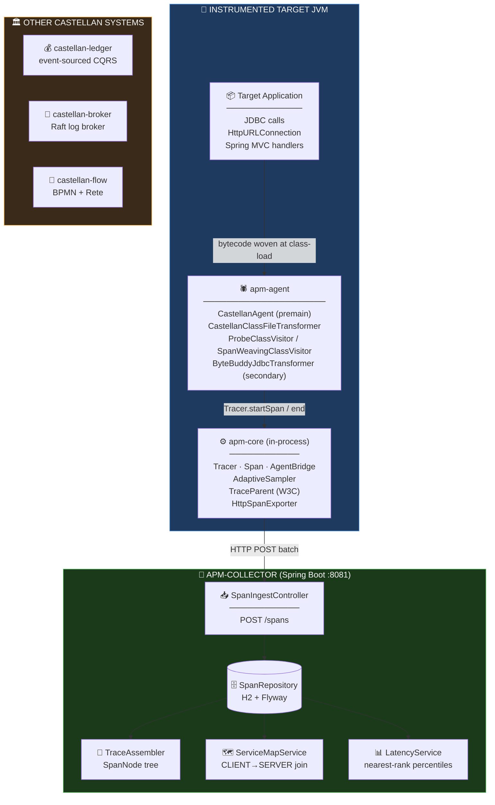
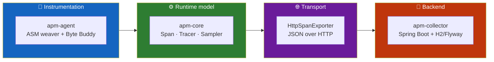
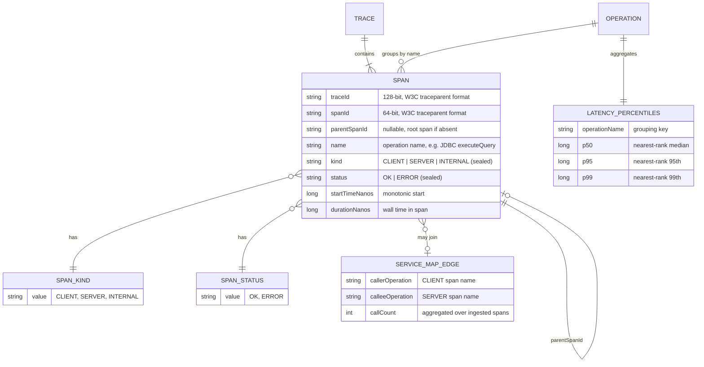
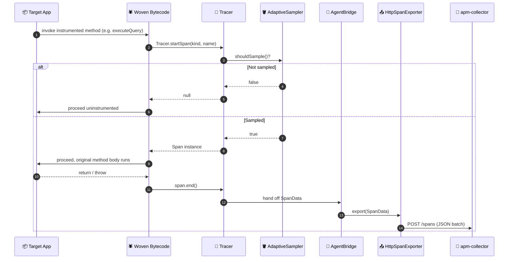
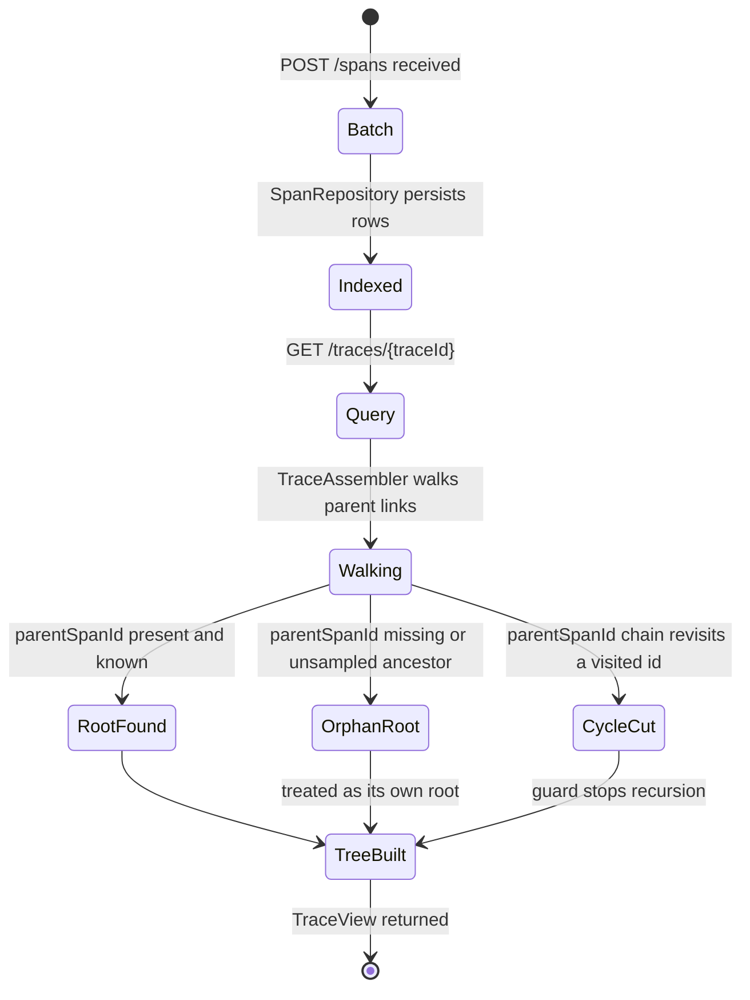
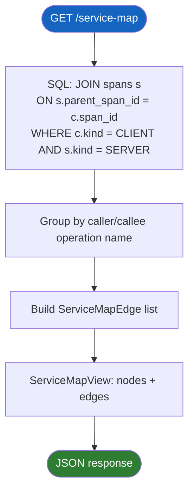
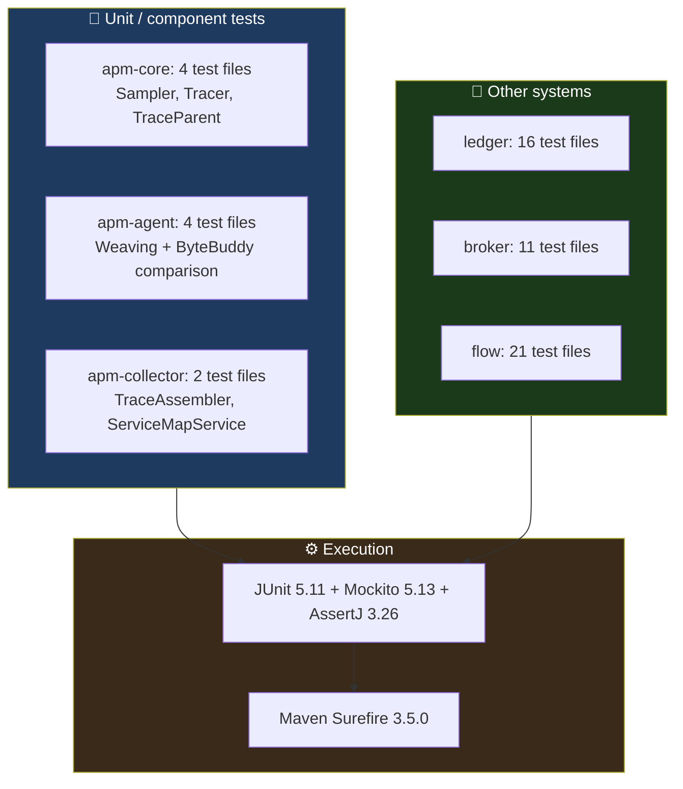

<div align="center">

**🌐 Choose Language / Selecione o Idioma / Elija el Idioma**

[](README.md)&nbsp;&nbsp;&nbsp;[](README_PT.md)&nbsp;&nbsp;&nbsp;[](README_ES.md)

</div>

---

<div align="center">

```
 ██████╗ █████╗ ███████╗████████╗███████╗██╗     ██╗      █████╗ ███╗   ██╗
██╔════╝██╔══██╗██╔════╝╚══██╔══╝██╔════╝██║     ██║     ██╔══██╗████╗  ██║
██║     ███████║███████╗   ██║   █████╗  ██║     ██║     ███████║██╔██╗ ██║
██║     ██╔══██║╚════██║   ██║   ██╔══╝  ██║     ██║     ██╔══██║██║╚██╗██║
╚██████╗██║  ██║███████║   ██║   ███████╗███████╗███████╗██║  ██║██║ ╚████║
 ╚═════╝╚═╝  ╚═╝╚══════╝   ╚═╝   ╚══════╝╚══════╝╚══════╝╚═╝  ╚═╝╚═╝  ╚═══╝
        Four hand-built Java systems: ledger, broker, APM agent, workflow engine
```

---

[](https://openjdk.org/)
[](https://maven.apache.org/)
[](https://spring.io/projects/spring-boot)
[](https://asm.ow2.io/)
[](https://junit.org/junit5/)
[](https://www.h2database.com/)

<br/>

> **Four independent Java systems, each built from scratch with no framework doing the load-bearing work.**
> An event-sourced ledger, a Raft-based log broker, a bytecode-weaving APM agent, and a BPMN/Rete workflow engine.

<br/>


</div>

---

## 📑 Table of Contents

<details>
<summary>▶️ <strong>Click to expand / collapse this section</strong></summary>

<table>
<tr>
<td valign="top" width="50%">

**🏗️ System**
- [Overview](#-overview)
- [System Architecture](#-system-architecture)
- [Technology Stack](#-technology-stack)
- [Design Patterns](#-design-patterns-applied)
- [Project Structure](#-project-structure)

**📦 Modules**
- [castellan-ledger](#-castellan-ledger--event-sourced-banking-ledger)
- [castellan-broker](#-castellan-broker--distributed-log-broker)
- [castellan-apm (apm-agent)](#-apm-agent--bytecode-weaving-instrumentation)
- [castellan-apm (apm-collector)](#-apm-collector--trace-ingestion--query)
- [castellan-flow](#-castellan-flow--bpmn--rete-workflow-engine)

</td>
<td valign="top" width="50%">

**💼 Business**
- [Business Rules](#-business-rules)
- [Functional Requirements](#-functional-requirements)
- [Non-Functional Requirements](#-non-functional-requirements)

**📐 Design**
- [Data Model](#-data-model)
- [System Flows](#-system-flows)

**🔐 Security & Ops**
- [Security](#-security)
- [Installation & Execution](#-installation--execution)
- [Automated Tests](#-automated-tests)
- [Metrics & Monitoring](#-metrics--monitoring)
- [Known Limitations](#-known-limitations)

</td>
</tr>
</table>

---

</details>

## 🌟 Overview

<details>
<summary>▶️ <strong>Click to expand / collapse this section</strong></summary>

**Castellan** is a single Maven reactor containing four independent Java systems, each of which
tackles the kind of infrastructure problem most applications outsource to a framework or a managed
service, and instead builds the load-bearing part from scratch: `castellan-ledger` is an
event-sourced, double-entry core banking ledger with CQRS and saga orchestration; `castellan-broker`
is a distributed log broker (a small Kafka) with a hand-written Raft consensus implementation, not a
wrapper around a Raft library; `castellan-apm` is a Java Application Performance Monitoring agent
that instruments a running JVM via `java.lang.instrument` and hand-written ASM bytecode weaving; and
`castellan-flow` is a BPMN 2.0 process engine backed by a Rete rule engine built from its alpha/beta
network up.

The four systems do not share a runtime or a database. What they share is a layering discipline: every
leaf module has a pure-Java core with zero framework dependency at the bottom (`ledger-domain`,
`broker-raft`, `apm-core`, `flow-rules`), an application/orchestration layer above it, and — only
where the system genuinely needs one — a Spring Boot module at the top wiring real JDBC adapters and
REST controllers to the layers beneath. Every module documents its own scope cuts directly in
class-level javadoc; that javadoc, not any README, is the project's authoritative design record.

This document focuses on `castellan-apm` (the agent + collector pair) as the primary subject, since it
is the APM-style component of the platform, while still describing the other three systems accurately
enough to understand how the whole reactor fits together and why the APM agent's design choices (no
`service.name`, ASM as primary weaver, Byte Buddy as a comparison path) were made the way they were.

### 🎯 System Objectives

| Objective | Description |
|-----------|-------------|
| 🧵 **Trace propagation** | `apm-agent` weaves span creation and W3C `traceparent` propagation into JDBC, `HttpURLConnection`, and Spring MVC call sites with zero source changes to the target app |
| 🎯 **Adaptive sampling** | `AdaptiveSampler` in `apm-core` uses a token-bucket algorithm to bound the sampled span rate rather than sampling a fixed percentage |
| 📡 **Trace ingestion** | `apm-collector` exposes an HTTP ingestion endpoint (`SpanIngestController`) that `apm-core`'s `HttpSpanExporter` posts batches of exported spans to |
| 🧩 **Trace reassembly** | `TraceAssembler` rebuilds a parent/child span tree from an arbitrarily-ordered flat batch, defensively handling missing and cyclic parents |
| 🗺️ **Service-map derivation** | `ServiceMapService` derives caller/callee edges purely from `CLIENT`→`SERVER` span parent links, since the model carries no service identity |
| 📊 **Latency percentiles** | `LatencyService` computes nearest-rank percentiles per operation name over the most recent N durations |
| 💰 **Event-sourced ledger** | `castellan-ledger` posts double-entry transactions as immutable domain events, never mutates a stored balance |
| 🌳 **Consensus from the paper** | `castellan-broker`'s `broker-raft` implements the Raft paper's Figure 2 as a pure, I/O-free state machine |
| 🧠 **Rule engine from scratch** | `castellan-flow`'s `flow-rules` is a genuine Rete network (alpha nodes, join nodes, an agenda), not a decision table |

---

</details>

## 🏗️ System Architecture

<details>
<summary>▶️ <strong>Click to expand / collapse this section</strong></summary>

### Module Diagram



### Architecture Layers



---

</details>

## 🛠️ Technology Stack

<details>
<summary>▶️ <strong>Click to expand / collapse this section</strong></summary>

<table>
<thead>
<tr>
<th>Layer</th>
<th>Technology</th>
<th>Version</th>
<th>Purpose</th>
</tr>
</thead>
<tbody>
<tr>
<td rowspan="2"><strong>🧠 Language / Build</strong></td>
<td>Java</td>
<td>21 (<code>maven.compiler.release</code>)</td>
<td>Source language for all 20 modules, records + sealed interfaces used throughout</td>
</tr>
<tr>
<td>Maven</td>
<td>reactor, <code>packaging=pom</code></td>
<td>Root <code>pom.xml</code> aggregates 4 aggregator POMs, 20 leaf modules</td>
</tr>
<tr>
<td rowspan="3"><strong>🕷️ Bytecode weaving (apm-agent)</strong></td>
<td>ASM</td>
<td>9.7 (<code>asm</code>, <code>asm-commons</code>, <code>asm-util</code>)</td>
<td>Primary weaver: <code>ProbeClassVisitor</code>, <code>SpanWeavingClassVisitor</code>/<code>MethodVisitor</code></td>
</tr>
<tr>
<td>Byte Buddy</td>
<td>1.15.1 (<code>byte-buddy</code>, <code>byte-buddy-agent</code>)</td>
<td>Secondary, JDBC-only comparison transformer (<code>ByteBuddyJdbcTransformer</code>)</td>
</tr>
<tr>
<td><code>java.lang.instrument</code></td>
<td>JDK 21 built-in</td>
<td><code>CastellanAgent</code> premain entry point, class retransformation</td>
</tr>
<tr>
<td rowspan="4"><strong>📡 apm-collector (Spring Boot)</strong></td>
<td>Spring Boot</td>
<td>3.3.4</td>
<td><code>spring-boot-starter-web</code>, <code>spring-boot-starter-jdbc</code> — REST + JDBC wiring</td>
</tr>
<tr>
<td>H2 Database</td>
<td>2.3.232</td>
<td>Embedded relational store for spans, service map edges, latency history</td>
</tr>
<tr>
<td>Flyway</td>
<td>10.17.3</td>
<td>Versioned schema migrations for the collector's H2 schema</td>
</tr>
<tr>
<td>Jackson</td>
<td>2.17.2 (<code>jackson-databind</code>)</td>
<td>Span JSON serialization shared between <code>apm-core</code> exporter and collector ingestion</td>
</tr>
<tr>
<td rowspan="2"><strong>📦 Shared / other systems</strong></td>
<td>SLF4J</td>
<td>2.0.16</td>
<td>Logging facade used across every module</td>
</tr>
<tr>
<td>Picocli</td>
<td>4.7.6</td>
<td>CLI parsing for <code>broker-server</code>'s standalone node process</td>
</tr>
<tr>
<td rowspan="3"><strong>🧪 Testing</strong></td>
<td>JUnit</td>
<td>5.11.0 (BOM)</td>
<td>All 58 test classes across the reactor</td>
</tr>
<tr>
<td>Mockito</td>
<td>5.13.0</td>
<td><code>apm-agent</code> uses it for retransformation/servlet mocking</td>
</tr>
<tr>
<td>AssertJ</td>
<td>3.26.3</td>
<td>Fluent assertions, root-level dependency for every module</td>
</tr>
<tr>
<td><strong>📦 Packaging</strong></td>
<td>Maven Shade Plugin</td>
<td>3.6.0</td>
<td>Builds <code>apm-agent</code>'s shaded, self-contained agent jar with <code>Premain-Class</code> manifest entries</td>
</tr>
</tbody>
</table>

---

</details>

## 🎨 Design Patterns Applied

<details>
<summary>▶️ <strong>Click to expand / collapse this section</strong></summary>

| Pattern | Where | Rationale |
|---------|-------|-----------|
| 🧵 **Visitor** | `ProbeClassVisitor`, `SpanWeavingClassVisitor`, `SpanWeavingMethodVisitor` | ASM's own visitor chain is used to walk and rewrite class/method bytecode without a full parse tree |
| 🧭 **Strategy** | `CastellanAgent` selecting ASM weaving vs. `ByteBuddyJdbcTransformer` via the `transformer=bytebuddy` agent argument | Two independent instrumentation strategies for the same JDBC instrumentation point, kept for comparison |
| 🚪 **SPI / Port** | `SpanExporter` interface, implemented by `HttpSpanExporter` and `LoggingSpanExporter` | `apm-core` never depends on how spans leave the process |
| 🪣 **Token Bucket** | `AdaptiveSampler` | Bounds sampled throughput under load spikes rather than a fixed percentage sample rate |
| 🧱 **Builder / Plan object** | `MethodWeavingPlan`, `MethodProbe` | Instrumentation rules produce an intermediate plan object consumed uniformly by the weaving visitor |
| 🧩 **Two-phase transform** | `CastellanClassFileTransformer` delegating to `ClassContext` + per-target `MethodInstrumentationRule`s (`JdbcInstrumentationRule`, `HttpUrlConnectionInstrumentationRule`, `SpringMvcInstrumentationRule`) | Each instrumentation target is a self-contained rule object rather than one large `if/else` transformer |
| 🧾 **Sealed hierarchy / exhaustive switch** | `SpanKind`, `SpanStatus`, ledger's 11 domain events, Raft's 4 RPC shapes | Closed variant sets are modeled as Java 21 sealed interfaces, never an open enum with a default branch |
| 🌳 **Tree reconstruction with cycle guard** | `TraceAssembler` | A visited-id set prevents infinite recursion on a malformed/duplicate `parentSpanId` chain |
| 🗺️ **Read-model projection** | `AccountBalanceProjection` (ledger), `ServiceMapService` (apm-collector) | Both derive a queryable view from an event/span log rather than holding it as mutable aggregate state |
| ⚙️ **Imperative shell / functional core** | `RaftNode` (pure) driven by `RaftEventLoop` (I/O) | Mirrors etcd's `raft.Ready()` pattern so the consensus logic is testable without a network or a clock |

---

</details>

## 📁 Project Structure

<details>
<summary>▶️ <strong>Click to expand / collapse this section</strong></summary>

```
castellan/
│
├── 📄 pom.xml                             # Root reactor: Java 21, shared dependencyManagement (Spring Boot BOM, JUnit, ASM, Byte Buddy, H2, Flyway, Jackson)
├── 📄 README.md                           # 🇺🇸 English (primary, this file)
├── 📄 README_PT.md                        # 🇧🇷 Português
├── 📄 README_ES.md                        # 🇪🇸 Español
│
├── 📂 castellan-apm/                      # ★ APM-style agent + collector platform (this README's focus)
│   ├── 📄 pom.xml                         # Aggregator: apm-core, apm-agent, apm-collector
│   ├── 📂 apm-core/
│   │   └── 📂 src/main/java/io/castellan/apm/core/
│   │       ├── 📄 Tracer.java             # ThreadLocal span-context API, starts/ends spans
│   │       ├── 📄 Span.java / SpanData.java   # Mutable span + immutable exported wire form
│   │       ├── 📄 SpanKind.java / SpanStatus.java  # Sealed enums: CLIENT/SERVER/INTERNAL, OK/ERROR
│   │       ├── 📄 TraceParent.java        # W3C traceparent header parse/format
│   │       ├── 📄 AgentBridge.java        # The one call surface apm-agent's woven bytecode invokes
│   │       ├── 📄 IdGenerator.java        # Trace/span id generation
│   │       ├── 📂 sampling/AdaptiveSampler.java  # Token-bucket sampler
│   │       └── 📂 export/                 # SpanExporter SPI, HttpSpanExporter, LoggingSpanExporter
│   │
│   ├── 📂 apm-agent/
│   │   └── 📂 src/main/java/io/castellan/apm/agent/
│   │       ├── 📄 CastellanAgent.java     # premain entry point, argument parsing
│   │       ├── 📄 AgentConfig.java        # collectorUrl / sampleRate / transformer options
│   │       ├── 📂 weave/                  # ASM primary path: ClassFileTransformer, visitors, weaving plan
│   │       │   ├── 📄 CastellanClassFileTransformer.java
│   │       │   ├── 📄 ProbeClassVisitor.java / SpanWeavingClassVisitor.java / SpanWeavingMethodVisitor.java
│   │       │   ├── 📄 MethodInstrumentationRule.java / MethodProbe.java / MethodWeavingPlan.java
│   │       │   ├── 📂 jdbc/JdbcInstrumentationRule.java
│   │       │   ├── 📂 http/HttpUrlConnectionInstrumentationRule.java
│   │       │   └── 📂 mvc/SpringMvcInstrumentationRule.java
│   │       └── 📂 bytebuddy/ByteBuddyJdbcTransformer.java   # Secondary, comparison-only JDBC transformer
│   │
│   └── 📂 apm-collector/
│       └── 📂 src/main/java/io/castellan/apm/collector/
│           ├── 📄 CollectorApplication.java   # Spring Boot main class
│           ├── 📂 ingest/SpanIngestController.java / SpanRepository.java   # POST /spans, H2 persistence
│           ├── 📂 trace/TraceAssembler.java / TraceController.java / SpanNode.java / TraceView.java  # GET /traces/{id}
│           ├── 📂 servicemap/ServiceMapService.java / ServiceMapController.java  # GET /service-map
│           └── 📂 latency/LatencyService.java / LatencyController.java   # GET /operations/{name}/latency
│
├── 📂 castellan-ledger/                   # Event-sourced double-entry banking ledger (4 modules)
│   ├── 📂 ledger-domain/                  # Money, Account, DoubleEntryTransaction, domain events, EventStore port
│   ├── 📂 ledger-application/             # Command handlers, TransferSagaOrchestrator, FraudRuleEngine
│   ├── 📂 ledger-infrastructure/          # JDBC EventStore, OutboxRelay, read-model projections
│   └── 📂 ledger-api/                     # Spring Boot REST API, TenantResolvingFilter
│
├── 📂 castellan-broker/                   # Distributed log broker with hand-written Raft (5 modules)
│   ├── 📂 broker-raft/                    # RaftNode: Figure-2 state machine, zero I/O, zero threads
│   ├── 📂 broker-storage/                 # PartitionLog, FileRaftLog/FilePersistentState
│   ├── 📂 broker-protocol/                # Binary wire framing + codecs
│   ├── 📂 broker-server/                  # RaftEventLoop, network listeners, GroupCoordinator
│   └── 📂 broker-client/                  # Producer, Consumer, LeaderRouter
│
├── 📂 castellan-flow/                     # BPMN process engine + Rete rule engine (4 modules)
│   ├── 📂 flow-rules/                     # Rete network: AlphaNode, JoinNode, Agenda
│   ├── 📂 flow-bpmn/                      # StAX BPMN 2.0 parser + ProcessInterpreter
│   ├── 📂 flow-engine/                    # Durable repositories, TimerScheduler, BPMN<->Rete bridge
│   └── 📂 flow-api/                       # Spring Boot REST API
│
└── 📂 docs/
    ├── 📄 ARCHITECTURE.md                 # The authoritative cross-system design map
    ├── 📄 ROADMAP.md                      # Current, complete list of known scope cuts
    └── 📂 adr/                            # 5 Architecture Decision Records (0001-0005)
```

---

</details>

## 📦 System Modules

<details>
<summary>▶️ <strong>Click to expand / collapse this section</strong></summary>

### 🕷️ apm-agent — Bytecode-weaving instrumentation

The `java.lang.instrument` entry point. `CastellanAgent.premain` parses agent arguments
(`collectorUrl`, `sampleRate`, `transformer`) via `AgentConfig`, then registers
`CastellanClassFileTransformer` with the `Instrumentation` instance so every class loaded from then
on is offered for instrumentation. `ProbeClassVisitor` first decides *whether* a class matches any
`MethodInstrumentationRule`, and only classes that match are handed to `SpanWeavingClassVisitor` for
the actual ASM bytecode rewrite, which keeps the common case (a class nobody wants to instrument)
cheap.

| Responsibility | Class | API surface |
|-----------------|-------|--------------|
| Agent bootstrap | `CastellanAgent` | `premain(String, Instrumentation)` |
| Argument parsing | `AgentConfig` | `collectorUrl=…`, `sampleRate=…`, `transformer=asm\|bytebuddy` |
| Class match + weave decision | `CastellanClassFileTransformer` | `transform(...)` per JVM class-load |
| Match detection | `ProbeClassVisitor` | Visits a class, produces a `MethodWeavingPlan` |
| Bytecode rewrite | `SpanWeavingClassVisitor` / `SpanWeavingMethodVisitor` | Wraps matched methods with `Tracer.startSpan`/`end` calls |
| Instrumentation targets | `JdbcInstrumentationRule`, `HttpUrlConnectionInstrumentationRule`, `SpringMvcInstrumentationRule` | Each implements `MethodInstrumentationRule` for one call-site family |
| Comparison path | `ByteBuddyJdbcTransformer` | JDBC-only, activated with `-javaagent:...=transformer=bytebuddy` |

---

### ⚙️ apm-core — Tracing runtime model

Framework-agnostic: `Span`/`SpanData`, a `Tracer` that manages the current span via `ThreadLocal`,
`TraceParent` for W3C header parsing/formatting, `AdaptiveSampler`, and the `SpanExporter` SPI. No
bytecode manipulation lives here; `AgentBridge` is the one narrow call surface the agent's woven-in
bytecode actually invokes at runtime, keeping the weaver's generated calls to a minimal, stable API.

| Responsibility | Class | Notes |
|-----------------|-------|-------|
| Span lifecycle | `Tracer` | `startSpan(kind, name)` returns `null` for an unsampled span — never sent downstream |
| Wire representation | `SpanData` | Immutable, Jackson-serializable form posted to the collector |
| Trace propagation | `TraceParent` | W3C `traceparent` header format |
| Sampling | `AdaptiveSampler` | Token-bucket; bounds rate under load rather than a fixed percentage |
| Export | `SpanExporter` (SPI), `HttpSpanExporter`, `LoggingSpanExporter` | HTTP export posts batches to `apm-collector`'s `/spans` |

---

### 📡 apm-collector — Trace ingestion & query

A Spring Boot application (`CollectorApplication`, port `8081` by convention) that receives exported
span batches, persists them to H2 via Flyway-migrated schema, and exposes three query surfaces.

| Endpoint family | Controller | Backing logic |
|-------------------|------------|----------------|
| `POST /spans` | `SpanIngestController` | `SpanRepository` persists the batch |
| `GET /traces/{traceId}` | `TraceController` | `TraceAssembler` rebuilds the `SpanNode` parent/child tree |
| `GET /service-map` | `ServiceMapController` | `ServiceMapService` joins `CLIENT`→`SERVER` spans by `parent_span_id` |
| `GET /operations/{name}/latency` | `LatencyController` | `LatencyService` computes nearest-rank percentiles |

`TraceAssembler` has two defensive properties: a span whose parent was never itself exported (an
unsampled ancestor) becomes its own root instead of vanishing, and a cyclic `parentSpanId` chain is
cut off by a visited-id guard instead of recursing forever.

---

### 💰 castellan-ledger — Event-sourced banking ledger

`ledger-domain` models `Money`, `Account`, `DoubleEntryTransaction` (its zero-sum invariant is
enforced in the constructor) and the domain events, behind an `EventStore` port. `ledger-application`
holds `PostTransactionHandler` (idempotent via a deterministic transaction id derived from the
client's idempotency key), `TransferSagaOrchestrator` (a real, restartable saga state machine), and
`FraudRuleEngine`. `ledger-infrastructure` provides the JDBC `EventStore`, `OutboxRelay`, and
read-model projections including `AccountBalanceProjection` — the account balance is never aggregate
state, only ever a projection computed from events. `ledger-api` is the Spring Boot REST layer with
`TenantResolvingFilter` enforcing a valid `X-Tenant-Id` before any request reaches a controller.

| Module | Key class | Role |
|--------|-----------|------|
| `ledger-domain` | `DoubleEntryTransaction` | Structurally impossible to construct an unbalanced transaction |
| `ledger-application` | `TransferSagaOrchestrator` | reserve → capture-or-fail → compensate, backed by its own event stream |
| `ledger-infrastructure` | `OutboxRelay` | Standard outbox pattern: same-transaction write, independently retryable relay |
| `ledger-api` | `TenantResolvingFilter` | Rejects any request lacking a valid `X-Tenant-Id` UUID |

---

### 🌳 castellan-broker — Distributed log broker

`broker-raft`'s `RaftNode` is a pure, I/O-free implementation of the Raft paper's Figure 2: every
public method takes the current event and returns a `HandleResult` (outbound envelopes + timer
resets), mirroring etcd's `raft.Ready()` pattern. `broker-storage` provides `PartitionLog` (segmented,
Kafka-style, CRC32C-verified crash recovery) and the separately fsync'd `FileRaftLog`/
`FilePersistentState`. `broker-protocol` defines a custom binary frame format. `broker-server` runs
`RaftEventLoop` (the single-threaded imperative shell around `RaftNode`) and `GroupCoordinator`
(consumer-group membership, deliberately not Raft-replicated). `broker-client` exposes `Producer`,
`Consumer`, and `LeaderRouter`.

| Module | Key class | Role |
|--------|-----------|------|
| `broker-raft` | `RaftNode` | Leader election, log replication, safety — zero threads, zero I/O |
| `broker-storage` | `PartitionLog` | Segmented append-only log with retention and compaction |
| `broker-protocol` | `Frame` | `[4-byte length][1-byte type][payload]` binary framing |
| `broker-server` | `RaftEventLoop` | Serializes RPCs, timers and client writes into single-threaded calls on `RaftNode` |
| `broker-client` | `LeaderRouter` | Leader discovery/caching shared by `Producer` and `Consumer` |

---

### 🔀 castellan-flow — BPMN + Rete workflow engine

`flow-rules` is a genuine Rete network (`AlphaNode`, `JoinNode`, `TerminalNode`, an `Agenda`) built
from scratch, with retraction and rule-set versioning. `flow-bpmn` parses BPMN 2.0 XML via StAX and
interprets it with a token-based `ProcessInterpreter`, including race groups for interrupting
boundary timers. `flow-engine` bridges BPMN execution to the Rete engine, maintains durable
process/instance/timer repositories, and re-parses pinned BPMN XML on every resume rather than caching
it. `flow-api` is the Spring Boot REST layer with `GlobalExceptionHandler` mapping parse errors to
400 and structurally-invalid transitions to 422.

| Module | Key class | Role |
|--------|-----------|------|
| `flow-rules` | `Agenda` | Resolves activation conflicts by salience-then-insertion-order |
| `flow-bpmn` | `ProcessState` | Fully externalizable execution state — variables, tokens, fork/compensation tracking |
| `flow-engine` | `TimerRepository` / `TimerScheduler` | Indexed range scan over `WAITING_TIMER` tokens, background poll |
| `flow-api` | `GlobalExceptionHandler` | `BpmnParseException`→400, `BpmnExecutionException`→422, not-found→404 |

---

</details>

## 💼 Business Rules

<details>
<summary>▶️ <strong>Click to expand / collapse this section</strong></summary>

### 🕷️ Tracing & Sampling Rules

| # | Rule | Enforcement |
|---|------|-------------|
| BR-01 | An unsampled span must never be exported | `Tracer.startSpan` returns `null` for an unsampled span, so woven call sites simply skip the export call |
| BR-02 | Sampled span throughput is bounded, not a fixed percentage | `AdaptiveSampler`'s token bucket refills at a configured rate rather than sampling every Nth call |
| BR-03 | `HttpURLConnection` `traceparent` injection must happen at `connect()` | The one point before headers may no longer be set, per `HttpUrlConnectionInstrumentationRule` |
| BR-04 | A Spring MVC handler only continues an inbound trace if it declares `HttpServletRequest` explicitly | Stated scope cut in `SpringMvcInstrumentationRule`; handlers without that parameter start a fresh trace |
| BR-05 | A JDBC call site is instrumented once, never double-wrapped | `ProbeClassVisitor` matches before `SpanWeavingClassVisitor` rewrites, per class per transformer pass |

### 📡 Trace Assembly & Service Map Rules

| # | Rule | Enforcement |
|---|------|-------------|
| BR-06 | A span whose parent was never exported becomes its own root | `TraceAssembler` treats a missing parent id as a new root instead of discarding the span |
| BR-07 | A cyclic `parentSpanId` chain must not recurse forever | Visited-id guard in `TraceAssembler`, proven by a constructed duplicate-id test |
| BR-08 | A service-map edge requires a `CLIENT` span whose id equals a `SERVER` span's `parentSpanId` | `ServiceMapService`'s SQL join, not an in-memory graph walk |
| BR-09 | Latency percentiles use the nearest-rank method over the most recent N durations per operation name | `LatencyService` |

### 💰 Ledger Rules (for platform context)

| # | Rule | Enforcement |
|---|------|-------------|
| BR-10 | Every posting set must sum to zero | Enforced in `DoubleEntryTransaction`'s constructor |
| BR-11 | A retried post with the same idempotency key must not double-post | `PostTransactionHandler`'s deterministic transaction id + re-check against the event store |
| BR-12 | Every request must carry a valid `X-Tenant-Id` UUID | `TenantResolvingFilter` rejects before the controller |

---

</details>

## ✅ Functional Requirements

<details>
<summary>▶️ <strong>Click to expand / collapse this section</strong></summary>

| ID | Requirement | Priority | Status |
|----|-------------|----------|--------|
| **RF-01** | The agent shall instrument JDBC `Statement`/`PreparedStatement`/`Connection` calls | 🔴 High | ✅ Implemented |
| **RF-02** | The agent shall instrument outbound `HttpURLConnection` calls with `traceparent` propagation | 🔴 High | ✅ Implemented |
| **RF-03** | The agent shall instrument Spring MVC `@RequestMapping` handlers | 🟡 Medium | ✅ Implemented |
| **RF-04** | The agent shall support an ASM-based weaver as the primary instrumentation strategy | 🔴 High | ✅ Implemented |
| **RF-05** | The agent shall support a Byte Buddy JDBC transformer as a secondary, comparison strategy | 🟢 Low | ✅ Implemented |
| **RF-06** | The agent shall accept `collectorUrl`, `sampleRate`, and `transformer` as `-javaagent` arguments | 🔴 High | ✅ Implemented |
| **RF-07** | The sampler shall bound sampled span throughput via a token bucket | 🟡 Medium | ✅ Implemented |
| **RF-08** | Exported spans shall be posted as JSON batches to the collector's `/spans` endpoint | 🔴 High | ✅ Implemented |
| **RF-09** | The collector shall persist ingested spans to an embedded H2 database | 🔴 High | ✅ Implemented |
| **RF-10** | The collector shall reassemble a full trace tree from `GET /traces/{traceId}` | 🔴 High | ✅ Implemented |
| **RF-11** | The collector shall derive a service map from `GET /service-map` | 🟡 Medium | ✅ Implemented |
| **RF-12** | The collector shall compute latency percentiles from `GET /operations/{name}/latency` | 🟡 Medium | ✅ Implemented |
| **RF-13** | The collector shall apply Flyway migrations on startup | 🟡 Medium | ✅ Implemented |
| **RF-14** | The ledger shall post double-entry transactions as immutable domain events | 🔴 High | ✅ Implemented |
| **RF-15** | The ledger shall run transfers through a restartable saga orchestrator | 🔴 High | ✅ Implemented |
| **RF-16** | The broker shall elect a leader and replicate a log via Raft | 🔴 High | ✅ Implemented |
| **RF-17** | The broker client shall support an idempotent producer mode | 🟡 Medium | ✅ Implemented |
| **RF-18** | The flow engine shall parse and interpret BPMN 2.0 XML process definitions | 🔴 High | ✅ Implemented |
| **RF-19** | The flow engine shall evaluate rule sets via a from-scratch Rete network | 🟡 Medium | ✅ Implemented |
| **RF-20** | The flow engine shall fire boundary timers via a background scheduler | 🟡 Medium | ✅ Implemented |
| **RF-21** | The agent shall shade into a single self-contained jar with `Premain-Class` manifest entries | 🔴 High | ✅ Implemented |

---

</details>

## ⚡ Non-Functional Requirements

<details>
<summary>▶️ <strong>Click to expand / collapse this section</strong></summary>

| ID | Category | Requirement | Target |
|----|----------|-------------|--------|
| **RNF-01** | ⚡ Performance | ASM weaving should add negligible per-class-load overhead | Weaving only classes matched by `ProbeClassVisitor`, not every loaded class |
| **RNF-02** | ⚡ Performance | Sampler must not allow unbounded span export under load | Token-bucket refill rate is the hard cap, per `AdaptiveSampler` |
| **RNF-03** | 🧵 Concurrency | `RaftNode` must be safely callable without external synchronization | Guaranteed by `RaftEventLoop`'s single-threaded executor, not by `RaftNode` itself |
| **RNF-04** | 💾 Durability | A Raft log entry, once acknowledged, must survive a crash | `FileRaftLog`/`FilePersistentState` fsync per entry |
| **RNF-05** | 💾 Durability | A process instance parked on a timer must resume correctly from disk | Proven by `flow-engine`'s `RestartResumptionTest` with a fresh object graph |
| **RNF-06** | 🔐 Consistency | An account's stored balance must never drift from its event stream | Balance is a projection, never mutable aggregate state |
| **RNF-07** | 🔐 Consistency | A concurrent write to the same event stream must not silently lose an update | `ConcurrencyConflictException` on `expectedVersion` mismatch |
| **RNF-08** | 🧩 Portability | `apm-core` must have zero bytecode-manipulation dependency | `apm-agent` depends on `apm-core`, never the reverse |
| **RNF-09** | 🧱 Modularity | Every leaf module's pure-Java core must have zero Spring dependency | `ledger-domain`, `broker-raft`, `apm-core`, `flow-rules` |
| **RNF-10** | 🧪 Testability | `RaftNode` must be testable without a network, clock, or thread | `RaftClusterSimulationTest` drives 3 nodes purely via `HandleResult` feedback |
| **RNF-11** | 🌍 Compatibility | All modules must target Java 21 | `maven.compiler.release=21` at the reactor root |
| **RNF-12** | 📦 Packaging | `apm-agent` must produce a single deployable jar | Maven Shade Plugin, `shadedClassifierName=agent` |
| **RNF-13** | 🔧 Maintainability | Every closed variant set must use a sealed interface, never an open enum with a default | `SpanKind`, `SpanStatus`, ledger's domain events, Raft's RPC shapes |
| **RNF-14** | 🗄️ Recoverability | A torn trailing write to a partition log segment must not corrupt the log | `Segment.openOrCreate` re-validates CRC32C and truncates to the last known-good boundary |

---

</details>

## 🗄️ Data Model

<details>
<summary>▶️ <strong>Click to expand / collapse this section</strong></summary>

### Entity-Relationship Diagram



### `apm-collector` H2 Schema (Flyway-managed)

| Column group | Table | Notes |
|---------------|-------|-------|
| Span identity | `spans` | `trace_id`, `span_id`, `parent_span_id` (nullable) — primary ingestion target of `SpanIngestController` |
| Span attributes | `spans` | `name`, `kind`, `status`, `start_time_nanos`, `duration_nanos` |
| Derived views | in-memory, not tables | `TraceAssembler`, `ServiceMapService`, `LatencyService` compute their views from `spans` at query time, no separate materialized table |

### Agent Configuration Keys (in-memory, not persisted)

| Key | Parsed by | Default | Meaning |
|-----|-----------|---------|---------|
| `collectorUrl` | `AgentConfig` | none, required for HTTP export | Destination for `HttpSpanExporter` |
| `sampleRate` | `AgentConfig` | implementation default | Token-bucket refill parameter for `AdaptiveSampler` |
| `transformer` | `AgentConfig` | `asm` | `asm` (default, full coverage) or `bytebuddy` (JDBC-only, comparison) |

---

</details>

## 🔄 System Flows

<details>
<summary>▶️ <strong>Click to expand / collapse this section</strong></summary>

### Span Creation and Export Flow



### Trace Reassembly State Handling



### Service Map Derivation Flow



---

</details>

## 🔐 Security

<details>
<summary>▶️ <strong>Click to expand / collapse this section</strong></summary>

### Implemented Controls

| Control | Implementation | Effect |
|---------|---------------|--------|
| 🎯 **Scoped instrumentation** | `MethodInstrumentationRule` implementations only match JDBC, `HttpURLConnection`, and `@RequestMapping` call sites | The agent never rewrites arbitrary application logic outside its stated targets |
| 🧵 **`traceparent` at the legally-correct point** | `HttpUrlConnectionInstrumentationRule` injects the header at `connect()` | Avoids the `IllegalStateException` from setting headers after connection |
| 🚦 **Fail-safe unsampled path** | `Tracer.startSpan` returns `null` for unsampled spans | No partial or malformed span is ever built for work that was never going to be exported |
| 🔒 **Multi-tenant isolation (ledger)** | `TenantResolvingFilter` rejects any request without a valid `X-Tenant-Id` UUID | Every downstream repository query is scoped by tenant at the SQL layer |
| 🌳 **Consensus safety** | `RaftNode.advanceCommitIndexIfPossible` only commits based on a current-term majority | Prevents the classic Raft bug of silently committing a stale prior-term entry |
| 🧾 **Optimistic concurrency (ledger)** | `expectedVersion` check on every event append | A racing writer gets `ConcurrencyConflictException`, never a silently lost update |
| 🗄️ **CRC-verified log recovery** | `Segment.openOrCreate` re-validates CRC32C on open | A torn trailing write is truncated, not silently trusted |

### Known Security Limitations

> [!WARNING]
> These are inherent to the current design and stated in the modules' own javadoc; they should be
> understood before any component here is reused outside a learning/demo context.

| Limitation | Risk | Mitigation path |
|------------|------|-----------------|
| 🌐 **No authentication on collector ingestion** | `POST /spans` accepts any caller | Add an API-key or mTLS check in front of `SpanIngestController` |
| 🌐 **No authentication on the broker's client protocol** | Any TCP client that speaks the framing can produce/consume | Add SASL-style handshake to `broker-protocol` |
| 🔓 **Span payloads travel unencrypted by default** | `HttpSpanExporter` uses plain HTTP unless the `collectorUrl` itself is `https://` | Deploy behind TLS termination or configure an `https://` collector URL |
| 🧬 **No `service.name` in the tracing model** | A malicious span batch can claim to belong to any operation name | Not a security control gap by omission, but a stated modeling scope cut in `SpanKind`/`ServiceMapService` |
| 🕳️ **`X-Tenant-Id` is a raw client-supplied header** | A caller could still forge another tenant's UUID absent an authentication layer | Layer real authentication (e.g. OAuth2/JWT) in front of `TenantResolvingFilter`, which only validates format and presence |
| 📛 **`GroupCoordinator` membership is not Raft-replicated** | A split-brain during a coordinator failover could briefly assign the same partition twice | Documented, deliberate tradeoff — members simply rejoin the new leader |

---

</details>

## 🚀 Installation & Execution

<details>
<summary>▶️ <strong>Click to expand / collapse this section</strong></summary>

### Prerequisites

```bash
# Java 21 JDK
java -version         # expect 21+

# Maven 3.9+
mvn -version

# No external services required — H2 is embedded, Raft nodes are plain JVM processes
```

### Build

```bash
# From the repo root -- builds and tests every module in the reactor (336 tests)
mvn clean test

# Build only the APM systems and their dependency (apm-core)
mvn -pl castellan-apm/apm-core,castellan-apm/apm-agent,castellan-apm/apm-collector -am test

# Package the shaded, self-contained agent jar
mvn -pl castellan-apm/apm-agent -am package
# Output: castellan-apm/apm-agent/target/apm-agent-0.1.0-agent.jar
```

### Execution

```bash
# 1. Start the collector (Spring Boot, :8081)
mvn -pl castellan-apm/apm-collector -am spring-boot:run

# 2. Attach the agent to any target JVM application
java -javaagent:castellan-apm/apm-agent/target/apm-agent-0.1.0-agent.jar=collectorUrl=http://localhost:8081/spans,sampleRate=1000 \
  -jar your-application.jar

# 3. Query the collector
curl localhost:8081/traces/<traceId>
curl localhost:8081/service-map
curl localhost:8081/operations/JDBC%20executeQuery/latency

# Optional: run with the secondary Byte Buddy JDBC transformer instead of ASM
java -javaagent:apm-agent-0.1.0-agent.jar=collectorUrl=http://localhost:8081/spans,transformer=bytebuddy \
  -jar your-application.jar
```

The three other systems build and run the same way from the repo root:

```bash
mvn -pl castellan-ledger/ledger-api -am spring-boot:run    # :8080
mvn -pl castellan-flow/flow-api -am spring-boot:run        # :8082
mvn -pl castellan-broker/broker-server -am package
java -jar castellan-broker/broker-server/target/broker-server-*.jar \
  --node-id n0 --data-dir /tmp/n0 \
  --cluster n0@127.0.0.1:9100:9101,n1@127.0.0.1:9200:9201,n2@127.0.0.1:9300:9301
```

### Maven Targets

| Target | Purpose |
|--------|---------|
| `mvn clean test` | Build and test every module in the reactor |
| `mvn -pl <module> -am test` | Build and test one module plus its dependencies |
| `mvn -pl <module> -am package` | Package one module (produces jars, including the shaded agent jar) |
| `mvn -pl <spring-boot-module> -am spring-boot:run` | Run `ledger-api`, `apm-collector`, or `flow-api` |
| `mvn -pl castellan-broker/broker-server -am package && java -jar ...` | Run a standalone `broker-server` node |

### Build Configuration

| Setting | Value | Declared in |
|---------|-------|-------------|
| `maven.compiler.release` | `21` | Root `pom.xml` `<properties>` |
| `groupId` / root `artifactId` | `io.castellan` / `castellan` | Root `pom.xml` |
| `apm-agent` shaded classifier | `agent` | `apm-agent/pom.xml` shade-plugin config |
| `Premain-Class` / `Agent-Class` | `io.castellan.apm.agent.CastellanAgent` | `apm-agent/pom.xml` manifest transformer |
| `apm-collector` main class | `io.castellan.apm.collector.CollectorApplication` | `apm-collector/pom.xml` spring-boot-maven-plugin config |
| Surefire `argLine` | `-Xshare:off` | Root `pom.xml` `pluginManagement` |

---

</details>

## 🧪 Automated Tests

<details>
<summary>▶️ <strong>Click to expand / collapse this section</strong></summary>

### Test Architecture



| Module | Test files | Notable suite |
|--------|-----------|-----------------|
| `apm-core` | 4 | `AdaptiveSamplerTest` — steady-state rate measured only after draining the initial token burst |
| `apm-agent` | 4 | Weaving correctness tests + `ByteBuddyJdbcTransformer` retransformation tests |
| `apm-collector` | 2 | `TraceAssemblerTest` — constructed duplicate-`spanId` cycle test |
| `castellan-ledger` (4 modules) | 16 | Saga compensation, idempotent posting, projection consistency |
| `castellan-broker` (5 modules) | 11 | `RaftClusterSimulationTest` — 3-node cluster driven purely via `HandleResult` feedback |
| `castellan-flow` (4 modules) | 21 | `RestartResumptionTest`, `BoundaryTimerInterpretationTest`, `FlowApiIntegrationTest` |
| **Total** | **58 test files / 336 tests** | 0 failures, 0 errors across the reactor |

### Running the Tests

```bash
# Every module in the reactor
mvn clean test

# Just the APM systems
mvn -pl castellan-apm/apm-core,castellan-apm/apm-agent,castellan-apm/apm-collector -am test

# A single module
mvn -pl castellan-broker/broker-raft -am test

# Surefire HTML/XML reports land under each module's target/surefire-reports
```

### Manual Acceptance Checklist

| # | Scenario | Expected result |
|---|----------|-----------------|
| 1 | Start `apm-collector`, attach the agent to a JDBC-using app | `POST /spans` receives batches, `GET /traces/{id}` returns a populated tree |
| 2 | Call an instrumented `HttpURLConnection` outbound request | Outbound request carries a `traceparent` header injected at `connect()` |
| 3 | Set `sampleRate` very low | Fewer spans are exported, but the app's own behavior is unaffected |
| 4 | Attach with `transformer=bytebuddy` | Only JDBC calls are instrumented, Spring MVC and HTTP are not |
| 5 | Query `GET /service-map` after mixed CLIENT/SERVER traffic | Edges reflect only spans with a real `CLIENT`→`SERVER` parent link |
| 6 | Post a span batch with a self-referential `parentSpanId` | `GET /traces/{id}` still returns without hanging or erroring |
| 7 | Query `GET /operations/{name}/latency` | p50/p95/p99 reflect nearest-rank over the most recent samples |

---

</details>

## 📊 Metrics & Monitoring

<details>
<summary>▶️ <strong>Click to expand / collapse this section</strong></summary>

### Codebase Metrics

| Metric | Value |
|--------|-------|
| Maven modules | 20 leaf modules under 4 aggregators + root reactor |
| Main Java source files | 295 |
| Test files | 58 (336 tests, 0 failures, 0 errors) |
| `apm-agent` main classes | 14 (weave visitors, rules, config, ByteBuddy comparison path) |
| `apm-core` main classes | 12 (Span/Tracer/Sampler/export SPI) |
| `apm-collector` main classes | 13 (ingest, trace, service-map, latency) |
| Architecture Decision Records | 5, under `docs/adr/` |
| Java language level | 21 (`maven.compiler.release`) |

### Runtime Signals

| Signal | Source | Where to observe |
|--------|--------|------------------|
| Span export success/failure | `HttpSpanExporter` | Application logs (SLF4J), collector access log |
| Ingested span count | `SpanIngestController` → `SpanRepository` | H2 `spans` table row count |
| Sampler decision rate | `AdaptiveSampler` | Compare spans emitted by the app vs. spans received by the collector |
| Raft leader/term changes | `RaftEventLoop` | `broker-server` process logs |
| Trace reassembly anomalies | `TraceAssembler` | Orphan-root or cycle-cut counts, if logged by the caller |

### Useful Diagnostic Commands

```bash
# Confirm the agent attached and premain ran
java -javaagent:apm-agent-0.1.0-agent.jar=collectorUrl=http://localhost:8081/spans -jar app.jar 2>&1 | grep -i castellan

# Watch the collector's Spring Boot logs
mvn -pl castellan-apm/apm-collector -am spring-boot:run

# Confirm a trace assembled correctly / service map reflects expected edges
curl -s localhost:8081/traces/<traceId> | jq .
curl -s localhost:8081/service-map | jq .
```

### Standardized Return / Status Codes

| Code | Where | Meaning |
|------|-------|---------|
| `200` | `apm-collector` REST endpoints | Successful ingestion or query |
| `400` | `flow-api` `GlobalExceptionHandler` | `BpmnParseException` — malformed submitted XML |
| `404` | `flow-api` `GlobalExceptionHandler` | `NoSuchProcessInstanceException` |
| `422` | `flow-api` `GlobalExceptionHandler` | `BpmnExecutionException` — structurally invalid transition |
| `null` (Span) | `Tracer.startSpan` | Sentinel for "not sampled", not an error |
| `ConcurrencyConflictException` | `ledger-infrastructure` | Optimistic-concurrency violation on event append |

---

</details>

## ⚠️ Known Limitations

<details>
<summary>▶️ <strong>Click to expand / collapse this section</strong></summary>

> [!IMPORTANT]
> Every module states its own design tradeoffs and scope cuts directly in class-level javadoc — that
> is the authoritative source, not this README. `docs/ROADMAP.md` holds the complete, current list.

| Category | Issue | Status |
|----------|-------|--------|
| 🌐 **No `service.name`** | The tracing data model carries no per-process service identity; the service map is derived purely from `CLIENT`/`SERVER` span parent links | ➕ Intentional, documented in `SpanKind` and `ServiceMapService` |
| 🧭 **Spring MVC inbound trace continuation** | Only handlers with an explicit `HttpServletRequest` parameter continue an inbound trace | ➕ Intentional, documented in `SpringMvcInstrumentationRule` |
| 🔀 **Consumer-group handshake collapsed** | `broker-server`'s protocol merges Kafka's two-phase `JoinGroup`+`SyncGroup` into one round trip | ➕ Intentional, documented in `GroupCoordinator` |
| 🧾 **Idempotent-producer dedup window is 1** | Only the single latest `(producerId, sequence)` per partition is remembered, not a window like Kafka's five | ➕ Intentional, documented in `CommandApplier` |
| 🧩 **JSON rule sets support one pattern only** | A join predicate has no textual form; joined rule sets must use `flow-rules`' typed builder directly | ➕ Intentional, documented in `JsonRuleDefinition`, see ADR 0005 |
| 🗳️ **No Raft cluster membership changes** | No joint consensus (§6); cluster membership is static for its lifetime | ➕ Intentional, documented in `broker-raft`, see ADR 0002 |
| 🧊 **No Raft log snapshotting** | The consensus log is retained in full, not compacted via snapshot (§7) | ➕ Intentional, distinct from `broker-storage`'s separate data-log compaction |
| 🔐 **No authentication on collector ingestion or broker protocol** | Any caller that reaches the port can post spans or produce/consume | ⚠️ Open |
| 🧬 **`apm-agent` release packaging is unminified/unobfuscated** | The shaded jar ships readable bytecode | ➕ Intentional for a diagnostic tool |
| 📐 **`flow-engine` re-parses BPMN XML on every resume** | No cached parsed graph, deliberate simplicity choice over cache-invalidation complexity | ➕ Intentional, documented in `ProcessEngine` |
| 🧵 **Fixed set of instrumentation targets** | Only JDBC, `HttpURLConnection`, and Spring MVC are woven | ⚠️ Open |

> [!TIP]
> The single highest-value next step for `castellan-apm` is adding a `service.name` (or equivalent
> per-process identity) to the span model, since it is the one gap that most limits the service map's
> usefulness beyond a single-process demo, per the design note in `ServiceMapService`.

</details>

---

<div align="center">

---

### 🏰 Castellan

*Four systems, no shortcuts, no framework doing the load-bearing work*

[](https://openjdk.org/)
[](https://asm.ow2.io/)
[](https://spring.io/projects/spring-boot)
[]()

<br/>

```
"A trace is only as trustworthy as the weaver that wrote it,
 and a system is only as honest as the javadoc that admits what it skipped."
```

</div>
