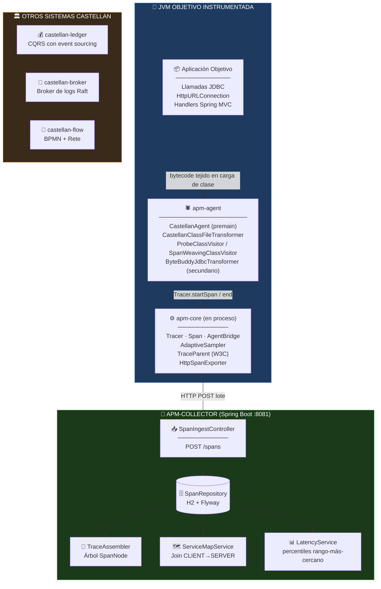
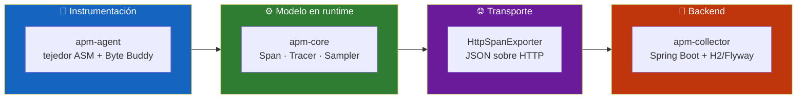
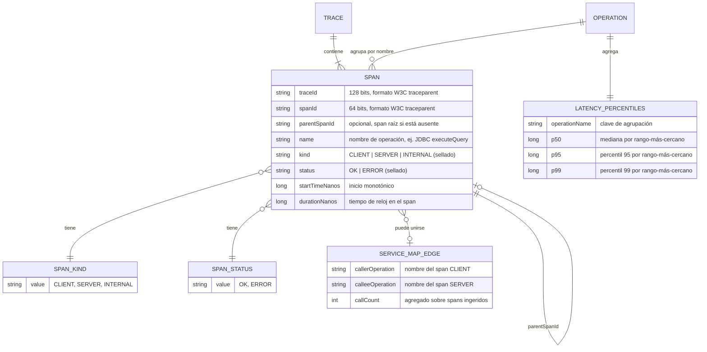
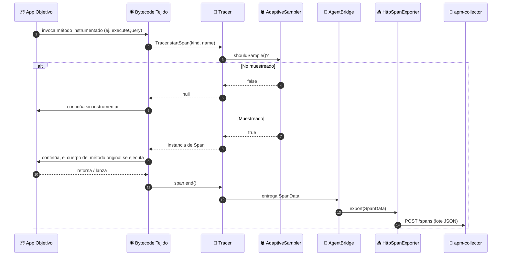
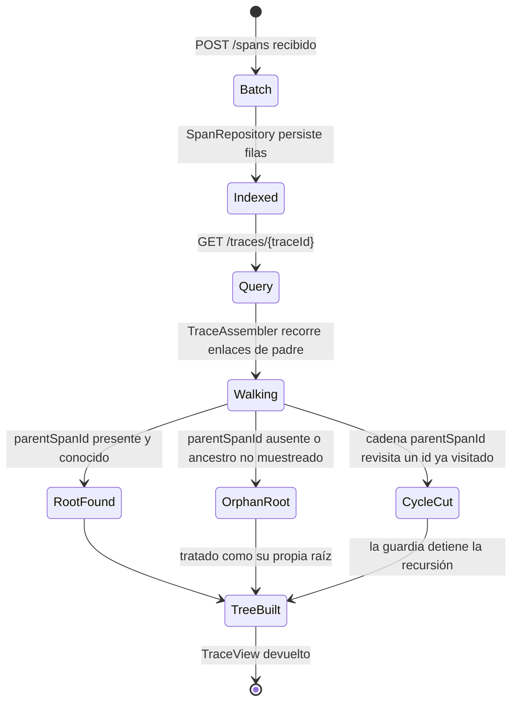
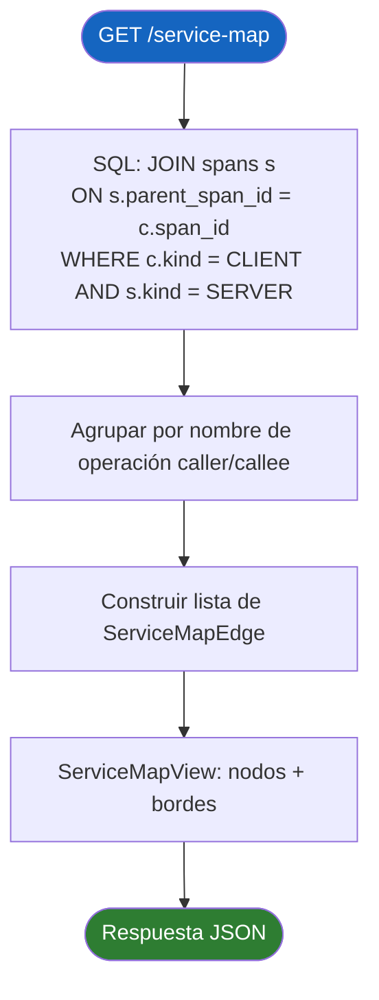
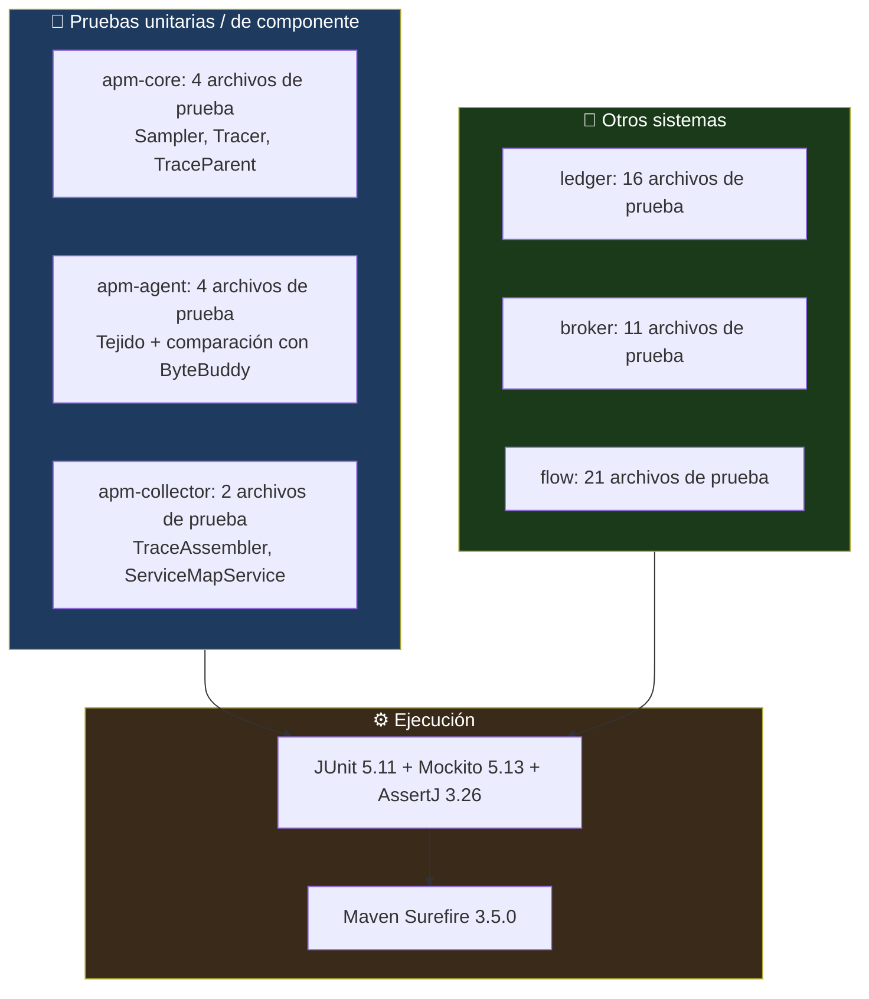

<div align="center">

**🌐 Choose Language / Selecione o Idioma / Elija el Idioma**

[](README.md)&nbsp;&nbsp;&nbsp;[](README_PT.md)&nbsp;&nbsp;&nbsp;[](README_ES.md)

</div>

---

<div align="center">

```
 ██████╗ █████╗ ███████╗████████╗███████╗██╗     ██╗      █████╗ ███╗   ██╗
██╔════╝██╔══██╗██╔════╝╚══██╔══╝██╔════╝██║     ██║     ██╔══██╗████╗  ██║
██║     ███████║███████╗   ██║   █████╗  ██║     ██║     ███████║██╔██╗ ██║
██║     ██╔══██║╚════██║   ██║   ██╔══╝  ██║     ██║     ██╔══██║██║╚██╗██║
╚██████╗██║  ██║███████║   ██║   ███████╗███████╗███████╗██║  ██║██║ ╚████║
 ╚═════╝╚═╝  ╚═╝╚══════╝   ╚═╝   ╚══════╝╚══════╝╚══════╝╚═╝  ╚═╝╚═╝  ╚═══╝
        Cuatro sistemas Java construidos a mano: ledger, broker, agente APM, motor de workflow
```

---

[](https://openjdk.org/)
[](https://maven.apache.org/)
[](https://spring.io/projects/spring-boot)
[](https://asm.ow2.io/)
[](https://junit.org/junit5/)
[](https://www.h2database.com/)

<br/>

> **Cuatro sistemas Java independientes, cada uno construido desde cero sin que ningún framework haga el trabajo estructural.**
> Un ledger con event sourcing, un broker de logs basado en Raft, un agente APM que teje bytecode y un motor de workflow BPMN/Rete.

<br/>


</div>

---

## 📑 Tabla de Contenidos

<details>
<summary>▶️ <strong>Haga clic para expandir / contraer esta sección</strong></summary>

<table>
<tr>
<td valign="top" width="50%">

**🏗️ Sistema**
- [Visión General](#-visión-general)
- [Arquitectura del Sistema](#-arquitectura-del-sistema)
- [Stack Tecnológico](#-stack-tecnológico)
- [Patrones de Diseño Aplicados](#-patrones-de-diseño-aplicados)
- [Estructura del Proyecto](#-estructura-del-proyecto)

**📦 Módulos**
- [castellan-ledger](#-castellan-ledger--ledger-bancario-con-event-sourcing)
- [castellan-broker](#-castellan-broker--broker-de-logs-distribuido)
- [castellan-apm (apm-agent)](#-apm-agent--instrumentación-por-tejido-de-bytecode)
- [castellan-apm (apm-collector)](#-apm-collector--ingesta-y-consulta-de-trazas)
- [castellan-flow](#-castellan-flow--motor-de-workflow-bpmn--rete)

</td>
<td valign="top" width="50%">

**💼 Negocio**
- [Reglas de Negocio](#-reglas-de-negocio)
- [Requisitos Funcionales](#-requisitos-funcionales)
- [Requisitos No Funcionales](#-requisitos-no-funcionales)

**📐 Diseño**
- [Modelo de Datos](#-modelo-de-datos)
- [Flujos del Sistema](#-flujos-del-sistema)

**🔐 Seguridad y Operaciones**
- [Seguridad](#-seguridad)
- [Instalación & Ejecución](#-instalación--ejecución)
- [Pruebas Automatizadas](#-pruebas-automatizadas)
- [Métricas & Monitoreo](#-métricas--monitoreo)
- [Limitaciones Conocidas](#-limitaciones-conocidas)

</td>
</tr>
</table>

---

</details>

## 🌟 Visión General

<details>
<summary>▶️ <strong>Haga clic para expandir / contraer esta sección</strong></summary>

**Castellan** es un único reactor Maven que contiene cuatro sistemas Java independientes, cada uno de
los cuales aborda el tipo de problema de infraestructura que la mayoría de las aplicaciones delega a
un framework o a un servicio administrado, y en su lugar construye desde cero la parte estructural:
`castellan-ledger` es un ledger bancario de doble entrada con event sourcing, CQRS y orquestación de
sagas; `castellan-broker` es un broker de logs distribuido (un pequeño Kafka) con una implementación de
consenso Raft escrita a mano, no un envoltorio sobre una librería de Raft; `castellan-apm` es un agente
de Application Performance Monitoring en Java que instrumenta una JVM en ejecución vía
`java.lang.instrument` y tejido de bytecode ASM escrito a mano; y `castellan-flow` es un motor de
procesos BPMN 2.0 respaldado por un motor de reglas Rete construido desde su red alpha/beta hacia
arriba.

Los cuatro sistemas no comparten runtime ni base de datos. Lo que comparten es una disciplina de
capas: cada módulo hoja tiene un núcleo Java puro sin dependencia de framework en la base
(`ledger-domain`, `broker-raft`, `apm-core`, `flow-rules`), una capa de aplicación/orquestación por
encima, y — solo donde el sistema realmente lo necesita — un módulo Spring Boot en la cima que conecta
adaptadores JDBC reales y controladores REST a las capas inferiores. Cada módulo documenta sus propios
recortes de alcance directamente en el javadoc a nivel de clase; ese javadoc, no ningún README, es el
registro de diseño autoritativo del proyecto.

Este documento se enfoca en `castellan-apm` (el par agente + collector) como tema principal, ya que es
el componente de estilo APM de la plataforma, aunque también describe con precisión suficiente los
otros tres sistemas para entender cómo encaja todo el reactor y por qué las decisiones de diseño del
agente APM (sin `service.name`, ASM como tejedor primario, Byte Buddy como camino de comparación) se
tomaron de esa manera.

### 🎯 Objetivos del Sistema

| Objetivo | Descripción |
|-----------|-------------|
| 🧵 **Propagación de trazas** | `apm-agent` teje la creación de spans y la propagación W3C `traceparent` en los puntos de llamada JDBC, `HttpURLConnection` y Spring MVC, sin cambios de código fuente en la app objetivo |
| 🎯 **Muestreo adaptativo** | `AdaptiveSampler` en `apm-core` usa un algoritmo de token-bucket para acotar la tasa de spans muestreados en lugar de muestrear un porcentaje fijo |
| 📡 **Ingesta de trazas** | `apm-collector` expone un endpoint HTTP de ingesta (`SpanIngestController`) al cual el `HttpSpanExporter` de `apm-core` publica lotes de spans exportados |
| 🧩 **Reensamblado de trazas** | `TraceAssembler` reconstruye un árbol padre/hijo de spans a partir de un lote plano en orden arbitrario, manejando defensivamente padres faltantes y cíclicos |
| 🗺️ **Derivación del mapa de servicios** | `ServiceMapService` deriva los bordes caller/callee puramente a partir de los enlaces padre `CLIENT`→`SERVER`, ya que el modelo no lleva identidad de servicio |
| 📊 **Percentiles de latencia** | `LatencyService` calcula percentiles por rango-más-cercano por nombre de operación sobre las N duraciones más recientes |
| 💰 **Ledger con event sourcing** | `castellan-ledger` registra transacciones de doble entrada como eventos de dominio inmutables, nunca muta un saldo almacenado |
| 🌳 **Consenso salido del paper** | `broker-raft` de `castellan-broker` implementa la Figura 2 del paper de Raft como una máquina de estados pura, sin I/O |
| 🧠 **Motor de reglas desde cero** | `flow-rules` de `castellan-flow` es una red Rete genuina (nodos alpha, nodos join, una agenda), no una tabla de decisión |

---

</details>

## 🏗️ Arquitectura del Sistema

<details>
<summary>▶️ <strong>Haga clic para expandir / contraer esta sección</strong></summary>

### Diagrama de Módulos



### Capas de Arquitectura



---

</details>

## 🛠️ Stack Tecnológico

<details>
<summary>▶️ <strong>Haga clic para expandir / contraer esta sección</strong></summary>

<table>
<thead>
<tr>
<th>Capa</th>
<th>Tecnología</th>
<th>Versión</th>
<th>Propósito</th>
</tr>
</thead>
<tbody>
<tr>
<td rowspan="2"><strong>🧠 Lenguaje / Build</strong></td>
<td>Java</td>
<td>21 (<code>maven.compiler.release</code>)</td>
<td>Lenguaje fuente para los 20 módulos, records + interfaces selladas usadas en todo el proyecto</td>
</tr>
<tr>
<td>Maven</td>
<td>reactor, <code>packaging=pom</code></td>
<td>El <code>pom.xml</code> raíz agrega 4 POMs agregadores, 20 módulos hoja</td>
</tr>
<tr>
<td rowspan="3"><strong>🕷️ Tejido de bytecode (apm-agent)</strong></td>
<td>ASM</td>
<td>9.7 (<code>asm</code>, <code>asm-commons</code>, <code>asm-util</code>)</td>
<td>Tejedor primario: <code>ProbeClassVisitor</code>, <code>SpanWeavingClassVisitor</code>/<code>MethodVisitor</code></td>
</tr>
<tr>
<td>Byte Buddy</td>
<td>1.15.1 (<code>byte-buddy</code>, <code>byte-buddy-agent</code>)</td>
<td>Transformador secundario, solo JDBC, de comparación (<code>ByteBuddyJdbcTransformer</code>)</td>
</tr>
<tr>
<td><code>java.lang.instrument</code></td>
<td>JDK 21 built-in</td>
<td>Punto de entrada premain de <code>CastellanAgent</code>, retransformación de clases</td>
</tr>
<tr>
<td rowspan="4"><strong>📡 apm-collector (Spring Boot)</strong></td>
<td>Spring Boot</td>
<td>3.3.4</td>
<td><code>spring-boot-starter-web</code>, <code>spring-boot-starter-jdbc</code> — conexión REST + JDBC</td>
</tr>
<tr>
<td>H2 Database</td>
<td>2.3.232</td>
<td>Almacén relacional embebido para spans, bordes del mapa de servicios, historial de latencia</td>
</tr>
<tr>
<td>Flyway</td>
<td>10.17.3</td>
<td>Migraciones de esquema versionadas para el esquema H2 del collector</td>
</tr>
<tr>
<td>Jackson</td>
<td>2.17.2 (<code>jackson-databind</code>)</td>
<td>Serialización JSON de spans compartida entre el exportador de <code>apm-core</code> y la ingesta del collector</td>
</tr>
<tr>
<td rowspan="2"><strong>📦 Compartido / otros sistemas</strong></td>
<td>SLF4J</td>
<td>2.0.16</td>
<td>Fachada de logging usada en todos los módulos</td>
</tr>
<tr>
<td>Picocli</td>
<td>4.7.6</td>
<td>Parsing de CLI para el proceso de nodo standalone de <code>broker-server</code></td>
</tr>
<tr>
<td rowspan="3"><strong>🧪 Pruebas</strong></td>
<td>JUnit</td>
<td>5.11.0 (BOM)</td>
<td>Las 58 clases de prueba en todo el reactor</td>
</tr>
<tr>
<td>Mockito</td>
<td>5.13.0</td>
<td><code>apm-agent</code> lo usa para retransformación/mocking de servlets</td>
</tr>
<tr>
<td>AssertJ</td>
<td>3.26.3</td>
<td>Aserciones fluidas, dependencia raíz para todos los módulos</td>
</tr>
<tr>
<td><strong>📦 Empaquetado</strong></td>
<td>Maven Shade Plugin</td>
<td>3.6.0</td>
<td>Construye el jar de agente shaded y autocontenido de <code>apm-agent</code> con entradas de manifest <code>Premain-Class</code></td>
</tr>
</tbody>
</table>

---

</details>

## 🎨 Patrones de Diseño Aplicados

<details>
<summary>▶️ <strong>Haga clic para expandir / contraer esta sección</strong></summary>

| Patrón | Dónde | Justificación |
|---------|-------|-----------|
| 🧵 **Visitor** | `ProbeClassVisitor`, `SpanWeavingClassVisitor`, `SpanWeavingMethodVisitor` | La propia cadena visitor de ASM se usa para recorrer y reescribir bytecode de clase/método sin un árbol de parseo completo |
| 🧭 **Strategy** | `CastellanAgent` eligiendo entre tejido ASM o `ByteBuddyJdbcTransformer` vía el argumento de agente `transformer=bytebuddy` | Dos estrategias de instrumentación independientes para el mismo punto de instrumentación JDBC, mantenidas para comparación |
| 🚪 **SPI / Port** | Interfaz `SpanExporter`, implementada por `HttpSpanExporter` y `LoggingSpanExporter` | `apm-core` nunca depende de cómo los spans salen del proceso |
| 🪣 **Token Bucket** | `AdaptiveSampler` | Acota el throughput muestreado bajo picos de carga en lugar de una tasa de muestreo de porcentaje fijo |
| 🧱 **Builder / Objeto plan** | `MethodWeavingPlan`, `MethodProbe` | Las reglas de instrumentación producen un objeto plan intermedio consumido uniformemente por el visitor de tejido |
| 🧩 **Transformación en dos fases** | `CastellanClassFileTransformer` delegando a `ClassContext` + `MethodInstrumentationRule`s por objetivo (`JdbcInstrumentationRule`, `HttpUrlConnectionInstrumentationRule`, `SpringMvcInstrumentationRule`) | Cada objetivo de instrumentación es un objeto regla autocontenido en lugar de un gran transformador `if/else` |
| 🧾 **Jerarquía sellada / switch exhaustivo** | `SpanKind`, `SpanStatus`, los 11 eventos de dominio del ledger, las 4 formas de RPC de Raft | Los conjuntos de variantes cerrados se modelan como interfaces selladas de Java 21, nunca un enum abierto con rama default |
| 🌳 **Reconstrucción de árbol con guardia de ciclos** | `TraceAssembler` | Un conjunto de ids visitados evita recursión infinita ante una cadena `parentSpanId` malformada/duplicada |
| 🗺️ **Proyección de modelo de lectura** | `AccountBalanceProjection` (ledger), `ServiceMapService` (apm-collector) | Ambos derivan una vista consultable a partir de un log de eventos/spans en lugar de mantenerla como estado mutable de agregado |
| ⚙️ **Shell imperativo / núcleo funcional** | `RaftNode` (puro) impulsado por `RaftEventLoop` (I/O) | Refleja el patrón `raft.Ready()` de etcd para que la lógica de consenso sea testeable sin red ni reloj |

---

</details>

## 📁 Estructura del Proyecto

<details>
<summary>▶️ <strong>Haga clic para expandir / contraer esta sección</strong></summary>

```
castellan/
│
├── 📄 pom.xml                             # Reactor raíz: Java 21, dependencyManagement compartido (Spring Boot BOM, JUnit, ASM, Byte Buddy, H2, Flyway, Jackson)
├── 📄 README.md                           # 🇺🇸 Inglés (principal)
├── 📄 README_PT.md                        # 🇧🇷 Português
├── 📄 README_ES.md                        # 🇪🇸 Español (este archivo)
│
├── 📂 castellan-apm/                      # ★ Plataforma agente + collector estilo APM (foco de este README)
│   ├── 📄 pom.xml                         # Agregador: apm-core, apm-agent, apm-collector
│   ├── 📂 apm-core/
│   │   └── 📂 src/main/java/io/castellan/apm/core/
│   │       ├── 📄 Tracer.java             # API de contexto de span vía ThreadLocal, inicia/termina spans
│   │       ├── 📄 Span.java / SpanData.java   # Span mutable + forma de cable inmutable exportada
│   │       ├── 📄 SpanKind.java / SpanStatus.java  # Enums sellados: CLIENT/SERVER/INTERNAL, OK/ERROR
│   │       ├── 📄 TraceParent.java        # Parseo/formato del header W3C traceparent
│   │       ├── 📄 AgentBridge.java        # La única superficie de llamada que invoca el bytecode tejido de apm-agent
│   │       ├── 📄 IdGenerator.java        # Generación de ids de traza/span
│   │       ├── 📂 sampling/AdaptiveSampler.java  # Sampler de token-bucket
│   │       └── 📂 export/                 # SPI SpanExporter, HttpSpanExporter, LoggingSpanExporter
│   │
│   ├── 📂 apm-agent/
│   │   └── 📂 src/main/java/io/castellan/apm/agent/
│   │       ├── 📄 CastellanAgent.java     # Punto de entrada premain, parseo de argumentos
│   │       ├── 📄 AgentConfig.java        # Opciones collectorUrl / sampleRate / transformer
│   │       ├── 📂 weave/                  # Camino primario ASM: ClassFileTransformer, visitors, plan de tejido
│   │       │   ├── 📄 CastellanClassFileTransformer.java
│   │       │   ├── 📄 ProbeClassVisitor.java / SpanWeavingClassVisitor.java / SpanWeavingMethodVisitor.java
│   │       │   ├── 📄 MethodInstrumentationRule.java / MethodProbe.java / MethodWeavingPlan.java
│   │       │   ├── 📂 jdbc/JdbcInstrumentationRule.java
│   │       │   ├── 📂 http/HttpUrlConnectionInstrumentationRule.java
│   │       │   └── 📂 mvc/SpringMvcInstrumentationRule.java
│   │       └── 📂 bytebuddy/ByteBuddyJdbcTransformer.java   # Transformador JDBC secundario, solo comparación
│   │
│   └── 📂 apm-collector/
│       └── 📂 src/main/java/io/castellan/apm/collector/
│           ├── 📄 CollectorApplication.java   # Clase principal Spring Boot
│           ├── 📂 ingest/SpanIngestController.java / SpanRepository.java   # POST /spans, persistencia H2
│           ├── 📂 trace/TraceAssembler.java / TraceController.java / SpanNode.java / TraceView.java  # GET /traces/{id}
│           ├── 📂 servicemap/ServiceMapService.java / ServiceMapController.java  # GET /service-map
│           └── 📂 latency/LatencyService.java / LatencyController.java   # GET /operations/{name}/latency
│
├── 📂 castellan-ledger/                   # Ledger bancario de doble entrada con event sourcing (4 módulos)
│   ├── 📂 ledger-domain/                  # Money, Account, DoubleEntryTransaction, eventos de dominio, puerto EventStore
│   ├── 📂 ledger-application/             # Manejadores de comandos, TransferSagaOrchestrator, FraudRuleEngine
│   ├── 📂 ledger-infrastructure/          # EventStore JDBC, OutboxRelay, proyecciones de modelo de lectura
│   └── 📂 ledger-api/                     # API REST Spring Boot, TenantResolvingFilter
│
├── 📂 castellan-broker/                   # Broker de logs distribuido con Raft escrito a mano (5 módulos)
│   ├── 📂 broker-raft/                    # RaftNode: máquina de estados de la Figura 2, cero I/O, cero hilos
│   ├── 📂 broker-storage/                 # PartitionLog, FileRaftLog/FilePersistentState
│   ├── 📂 broker-protocol/                # Framing binario de cable + codecs
│   ├── 📂 broker-server/                  # RaftEventLoop, listeners de red, GroupCoordinator
│   └── 📂 broker-client/                  # Producer, Consumer, LeaderRouter
│
├── 📂 castellan-flow/                     # Motor de procesos BPMN + motor de reglas Rete (4 módulos)
│   ├── 📂 flow-rules/                     # Red Rete: AlphaNode, JoinNode, Agenda
│   ├── 📂 flow-bpmn/                      # Parser BPMN 2.0 StAX + ProcessInterpreter
│   ├── 📂 flow-engine/                    # Repositorios durables, TimerScheduler, puente BPMN<->Rete
│   └── 📂 flow-api/                       # API REST Spring Boot
│
└── 📂 docs/
    ├── 📄 ARCHITECTURE.md                 # El mapa de diseño autoritativo entre sistemas
    ├── 📄 ROADMAP.md                      # Lista actual y completa de recortes de alcance conocidos
    └── 📂 adr/                            # 5 Registros de Decisión de Arquitectura (0001-0005)
```

---

</details>

## 📦 Módulos del Sistema

<details>
<summary>▶️ <strong>Haga clic para expandir / contraer esta sección</strong></summary>

### 🕷️ apm-agent — Instrumentación por tejido de bytecode

El punto de entrada de `java.lang.instrument`. `CastellanAgent.premain` parsea los argumentos del
agente (`collectorUrl`, `sampleRate`, `transformer`) vía `AgentConfig`, luego registra
`CastellanClassFileTransformer` con la instancia de `Instrumentation` de modo que toda clase cargada
desde entonces se ofrece para instrumentación. `ProbeClassVisitor` decide primero *si* una clase
coincide con alguna `MethodInstrumentationRule`, y solo las clases que coinciden se entregan a
`SpanWeavingClassVisitor` para la reescritura real de bytecode ASM, lo que mantiene barato el caso
común (una clase que nadie quiere instrumentar).

| Responsabilidad | Clase | Superficie de API |
|-----------------|-------|--------------|
| Arranque del agente | `CastellanAgent` | `premain(String, Instrumentation)` |
| Parseo de argumentos | `AgentConfig` | `collectorUrl=…`, `sampleRate=…`, `transformer=asm\|bytebuddy` |
| Decisión de coincidencia + tejido de clase | `CastellanClassFileTransformer` | `transform(...)` por cada carga de clase de la JVM |
| Detección de coincidencia | `ProbeClassVisitor` | Visita una clase, produce un `MethodWeavingPlan` |
| Reescritura de bytecode | `SpanWeavingClassVisitor` / `SpanWeavingMethodVisitor` | Envuelve métodos coincidentes con llamadas a `Tracer.startSpan`/`end` |
| Objetivos de instrumentación | `JdbcInstrumentationRule`, `HttpUrlConnectionInstrumentationRule`, `SpringMvcInstrumentationRule` | Cada uno implementa `MethodInstrumentationRule` para una familia de puntos de llamada |
| Camino de comparación | `ByteBuddyJdbcTransformer` | Solo JDBC, activado con `-javaagent:...=transformer=bytebuddy` |

---

### ⚙️ apm-core — Modelo de runtime de trazas

Agnóstico de framework: `Span`/`SpanData`, un `Tracer` que gestiona el span actual vía `ThreadLocal`,
`TraceParent` para el parseo/formato del header W3C, `AdaptiveSampler` y el SPI `SpanExporter`. Aquí
no vive manipulación de bytecode; `AgentBridge` es la única superficie de llamada estrecha que el
bytecode tejido del agente realmente invoca en runtime, manteniendo mínima y estable la API a la que
llama el tejedor.

| Responsabilidad | Clase | Notas |
|-----------------|-------|-------|
| Ciclo de vida del span | `Tracer` | `startSpan(kind, name)` devuelve `null` para un span no muestreado — nunca se envía río abajo |
| Representación de cable | `SpanData` | Forma inmutable, serializable con Jackson, publicada al collector |
| Propagación de traza | `TraceParent` | Formato del header W3C `traceparent` |
| Muestreo | `AdaptiveSampler` | Token-bucket; acota la tasa bajo carga en lugar de un porcentaje fijo |
| Exportación | `SpanExporter` (SPI), `HttpSpanExporter`, `LoggingSpanExporter` | La exportación HTTP publica lotes al `/spans` de `apm-collector` |

---

### 📡 apm-collector — Ingesta y consulta de trazas

Una aplicación Spring Boot (`CollectorApplication`, puerto `8081` por convención) que recibe lotes de
spans exportados, los persiste en H2 vía un esquema migrado con Flyway, y expone tres superficies de
consulta.

| Familia de endpoints | Controlador | Lógica de respaldo |
|-------------------|------------|----------------|
| `POST /spans` | `SpanIngestController` | `SpanRepository` persiste el lote |
| `GET /traces/{traceId}` | `TraceController` | `TraceAssembler` reconstruye el árbol padre/hijo `SpanNode` |
| `GET /service-map` | `ServiceMapController` | `ServiceMapService` une spans `CLIENT`→`SERVER` por `parent_span_id` |
| `GET /operations/{name}/latency` | `LatencyController` | `LatencyService` calcula percentiles por rango-más-cercano |

`TraceAssembler` tiene dos propiedades defensivas: un span cuyo padre nunca fue exportado en sí mismo
(un ancestro no muestreado) se convierte en su propia raíz en lugar de desaparecer, y una cadena
cíclica de `parentSpanId` se corta mediante una guardia de ids visitados en lugar de recursar
indefinidamente.

---

### 💰 castellan-ledger — Ledger bancario con event sourcing

`ledger-domain` modela `Money`, `Account`, `DoubleEntryTransaction` (su invariante de suma cero se
aplica en el constructor) y los eventos de dominio, detrás de un puerto `EventStore`.
`ledger-application` contiene `PostTransactionHandler` (idempotente vía un id de transacción
determinístico derivado de la clave de idempotencia del cliente), `TransferSagaOrchestrator` (una
máquina de estados de saga real y reanudable) y `FraudRuleEngine`. `ledger-infrastructure` provee el
`EventStore` JDBC, `OutboxRelay` y proyecciones de modelo de lectura incluyendo
`AccountBalanceProjection` — el saldo de la cuenta nunca es estado de agregado, siempre es una
proyección calculada a partir de eventos. `ledger-api` es la capa REST Spring Boot con
`TenantResolvingFilter` exigiendo un `X-Tenant-Id` válido antes de que cualquier solicitud llegue a un
controlador.

| Módulo | Clase clave | Rol |
|--------|-----------|------|
| `ledger-domain` | `DoubleEntryTransaction` | Estructuralmente imposible construir una transacción desbalanceada |
| `ledger-application` | `TransferSagaOrchestrator` | reservar → capturar-o-fallar → compensar, respaldado por su propio flujo de eventos |
| `ledger-infrastructure` | `OutboxRelay` | Patrón outbox estándar: escritura en la misma transacción, relay reintentable de forma independiente |
| `ledger-api` | `TenantResolvingFilter` | Rechaza cualquier solicitud que carezca de un UUID `X-Tenant-Id` válido |

---

### 🌳 castellan-broker — Broker de logs distribuido

`RaftNode` de `broker-raft` es una implementación pura, sin I/O, de la Figura 2 del paper de Raft:
cada método público toma el evento actual y devuelve un `HandleResult` (sobres salientes + reinicios
de temporizador), reflejando el patrón `raft.Ready()` de etcd. `broker-storage` provee `PartitionLog`
(segmentado, al estilo Kafka, con recuperación ante caídas verificada por CRC32C) y el
`FileRaftLog`/`FilePersistentState` con fsync separado. `broker-protocol` define un formato de trama
binario propio. `broker-server` ejecuta `RaftEventLoop` (el shell imperativo de un solo hilo alrededor
de `RaftNode`) y `GroupCoordinator` (membresía de grupo de consumidores, deliberadamente no replicada
por Raft). `broker-client` expone `Producer`, `Consumer` y `LeaderRouter`.

| Módulo | Clase clave | Rol |
|--------|-----------|------|
| `broker-raft` | `RaftNode` | Elección de líder, replicación de log, seguridad — cero hilos, cero I/O |
| `broker-storage` | `PartitionLog` | Log de solo-anexar segmentado con retención y compactación |
| `broker-protocol` | `Frame` | Framing binario `[longitud 4 bytes][tipo 1 byte][payload]` |
| `broker-server` | `RaftEventLoop` | Serializa RPCs, temporizadores y escrituras de clientes en llamadas de un solo hilo sobre `RaftNode` |
| `broker-client` | `LeaderRouter` | Descubrimiento/caché de líder compartido por `Producer` y `Consumer` |

---

### 🔀 castellan-flow — Motor de workflow BPMN + Rete

`flow-rules` es una red Rete genuina (`AlphaNode`, `JoinNode`, `TerminalNode`, una `Agenda`) construida
desde cero, con retracción y versionado de conjuntos de reglas. `flow-bpmn` parsea XML BPMN 2.0 vía
StAX y lo interpreta con un `ProcessInterpreter` basado en tokens, incluyendo grupos de carrera para
temporizadores de borde interruptores. `flow-engine` conecta la ejecución de BPMN con el motor Rete,
mantiene repositorios durables de proceso/instancia/temporizador, y vuelve a parsear el XML BPMN
anclado en cada reanudación en lugar de cachearlo. `flow-api` es la capa REST Spring Boot con
`GlobalExceptionHandler` mapeando errores de parseo a 400 y transiciones estructuralmente inválidas a
422.

| Módulo | Clase clave | Rol |
|--------|-----------|------|
| `flow-rules` | `Agenda` | Resuelve conflictos de activación por prominencia y luego orden de inserción |
| `flow-bpmn` | `ProcessState` | Estado de ejecución totalmente externalizable — variables, tokens, seguimiento de fork/compensación |
| `flow-engine` | `TimerRepository` / `TimerScheduler` | Escaneo indexado por rango sobre tokens `WAITING_TIMER`, sondeo en segundo plano |
| `flow-api` | `GlobalExceptionHandler` | `BpmnParseException`→400, `BpmnExecutionException`→422, no-encontrado→404 |

---

</details>

## 💼 Reglas de Negocio

<details>
<summary>▶️ <strong>Haga clic para expandir / contraer esta sección</strong></summary>

### 🕷️ Reglas de Trazado y Muestreo

| # | Regla | Cumplimiento |
|---|------|-------------|
| RN-01 | Un span no muestreado nunca debe exportarse | `Tracer.startSpan` devuelve `null` para un span no muestreado, así los puntos de llamada tejidos simplemente omiten la llamada de exportación |
| RN-02 | El throughput de spans muestreados está acotado, no es un porcentaje fijo | El token bucket de `AdaptiveSampler` se rellena a una tasa configurada en lugar de muestrear cada N-ésima llamada |
| RN-03 | La inyección de `traceparent` en `HttpURLConnection` debe ocurrir en `connect()` | El único punto antes de que los headers ya no puedan establecerse, según `HttpUrlConnectionInstrumentationRule` |
| RN-04 | Un handler de Spring MVC solo continúa una traza entrante si declara `HttpServletRequest` explícitamente | Recorte de alcance declarado en `SpringMvcInstrumentationRule`; los handlers sin ese parámetro inician una traza nueva |
| RN-05 | Un punto de llamada JDBC se instrumenta una vez, nunca se envuelve doble | `ProbeClassVisitor` coincide antes de que `SpanWeavingClassVisitor` reescriba, por clase y por pasada del transformador |

### 📡 Reglas de Ensamblado de Trazas y Mapa de Servicios

| # | Regla | Cumplimiento |
|---|------|-------------|
| RN-06 | Un span cuyo padre nunca fue exportado se convierte en su propia raíz | `TraceAssembler` trata un id de padre faltante como una nueva raíz en lugar de descartar el span |
| RN-07 | Una cadena cíclica de `parentSpanId` no debe recursar indefinidamente | Guardia de ids visitados en `TraceAssembler`, probada por una prueba de id duplicado construida a propósito |
| RN-08 | Un borde del mapa de servicios requiere un span `CLIENT` cuyo id sea igual al `parentSpanId` de un span `SERVER` | Join SQL de `ServiceMapService`, no un recorrido de grafo en memoria |
| RN-09 | Los percentiles de latencia usan el método de rango-más-cercano sobre las N duraciones más recientes por nombre de operación | `LatencyService` |

### 💰 Reglas del Ledger (para contexto de la plataforma)

| # | Regla | Cumplimiento |
|---|------|-------------|
| RN-10 | Todo conjunto de asientos debe sumar cero | Aplicado en el constructor de `DoubleEntryTransaction` |
| RN-11 | Un reintento con la misma clave de idempotencia no debe registrar doble | Id de transacción determinístico de `PostTransactionHandler` + reverificación contra el event store |
| RN-12 | Toda solicitud debe llevar un UUID `X-Tenant-Id` válido | `TenantResolvingFilter` rechaza antes del controlador |

---

</details>

## ✅ Requisitos Funcionales

<details>
<summary>▶️ <strong>Haga clic para expandir / contraer esta sección</strong></summary>

| ID | Requisito | Prioridad | Estado |
|----|-------------|----------|--------|
| **RF-01** | El agente debe instrumentar llamadas JDBC `Statement`/`PreparedStatement`/`Connection` | 🔴 Alta | ✅ Implementado |
| **RF-02** | El agente debe instrumentar llamadas salientes `HttpURLConnection` con propagación `traceparent` | 🔴 Alta | ✅ Implementado |
| **RF-03** | El agente debe instrumentar handlers `@RequestMapping` de Spring MVC | 🟡 Media | ✅ Implementado |
| **RF-04** | El agente debe soportar un tejedor basado en ASM como estrategia de instrumentación primaria | 🔴 Alta | ✅ Implementado |
| **RF-05** | El agente debe soportar un transformador JDBC de Byte Buddy como estrategia secundaria de comparación | 🟢 Baja | ✅ Implementado |
| **RF-06** | El agente debe aceptar `collectorUrl`, `sampleRate` y `transformer` como argumentos de `-javaagent` | 🔴 Alta | ✅ Implementado |
| **RF-07** | El sampler debe acotar el throughput de spans muestreados vía un token bucket | 🟡 Media | ✅ Implementado |
| **RF-08** | Los spans exportados deben publicarse como lotes JSON al endpoint `/spans` del collector | 🔴 Alta | ✅ Implementado |
| **RF-09** | El collector debe persistir los spans ingeridos en una base de datos H2 embebida | 🔴 Alta | ✅ Implementado |
| **RF-10** | El collector debe reensamblar un árbol de traza completo desde `GET /traces/{traceId}` | 🔴 Alta | ✅ Implementado |
| **RF-11** | El collector debe derivar un mapa de servicios desde `GET /service-map` | 🟡 Media | ✅ Implementado |
| **RF-12** | El collector debe calcular percentiles de latencia desde `GET /operations/{name}/latency` | 🟡 Media | ✅ Implementado |
| **RF-13** | El collector debe aplicar migraciones de Flyway al iniciar | 🟡 Media | ✅ Implementado |
| **RF-14** | El ledger debe registrar transacciones de doble entrada como eventos de dominio inmutables | 🔴 Alta | ✅ Implementado |
| **RF-15** | El ledger debe ejecutar transferencias a través de un orquestador de saga reanudable | 🔴 Alta | ✅ Implementado |
| **RF-16** | El broker debe elegir un líder y replicar un log vía Raft | 🔴 Alta | ✅ Implementado |
| **RF-17** | El cliente del broker debe soportar un modo de productor idempotente | 🟡 Media | ✅ Implementado |
| **RF-18** | El motor de flujo debe parsear e interpretar definiciones de proceso XML BPMN 2.0 | 🔴 Alta | ✅ Implementado |
| **RF-19** | El motor de flujo debe evaluar conjuntos de reglas vía una red Rete construida desde cero | 🟡 Media | ✅ Implementado |
| **RF-20** | El motor de flujo debe disparar temporizadores de borde vía un scheduler en segundo plano | 🟡 Media | ✅ Implementado |
| **RF-21** | El agente debe empaquetarse (shade) en un único jar autocontenido con entradas de manifest `Premain-Class` | 🔴 Alta | ✅ Implementado |

---

</details>

## ⚡ Requisitos No Funcionales

<details>
<summary>▶️ <strong>Haga clic para expandir / contraer esta sección</strong></summary>

| ID | Categoría | Requisito | Objetivo |
|----|----------|-------------|--------|
| **RNF-01** | ⚡ Rendimiento | El tejido ASM debe agregar una sobrecarga insignificante por carga de clase | Tejer solo las clases que coinciden con `ProbeClassVisitor`, no cada clase cargada |
| **RNF-02** | ⚡ Rendimiento | El sampler no debe permitir exportación de spans sin límite bajo carga | La tasa de rellenado del token-bucket es el tope duro, según `AdaptiveSampler` |
| **RNF-03** | 🧵 Concurrencia | `RaftNode` debe poder invocarse de forma segura sin sincronización externa | Garantizado por el ejecutor de un solo hilo de `RaftEventLoop`, no por `RaftNode` mismo |
| **RNF-04** | 💾 Durabilidad | Una entrada de log de Raft, una vez confirmada, debe sobrevivir a una caída | Fsync por entrada de `FileRaftLog`/`FilePersistentState` |
| **RNF-05** | 💾 Durabilidad | Una instancia de proceso detenida en un temporizador debe reanudarse correctamente desde disco | Probado por `RestartResumptionTest` de `flow-engine` con un grafo de objetos nuevo |
| **RNF-06** | 🔐 Consistencia | El saldo almacenado de una cuenta nunca debe desviarse de su flujo de eventos | El saldo es una proyección, nunca estado mutable de agregado |
| **RNF-07** | 🔐 Consistencia | Una escritura concurrente al mismo flujo de eventos no debe perder silenciosamente una actualización | `ConcurrencyConflictException` ante un desajuste de `expectedVersion` |
| **RNF-08** | 🧩 Portabilidad | `apm-core` debe tener cero dependencia de manipulación de bytecode | `apm-agent` depende de `apm-core`, nunca al revés |
| **RNF-09** | 🧱 Modularidad | El núcleo Java puro de cada módulo hoja debe tener cero dependencia de Spring | `ledger-domain`, `broker-raft`, `apm-core`, `flow-rules` |
| **RNF-10** | 🧪 Testabilidad | `RaftNode` debe poder probarse sin red, reloj ni hilo | `RaftClusterSimulationTest` maneja 3 nodos puramente vía retroalimentación de `HandleResult` |
| **RNF-11** | 🌍 Compatibilidad | Todos los módulos deben apuntar a Java 21 | `maven.compiler.release=21` en la raíz del reactor |
| **RNF-12** | 📦 Empaquetado | `apm-agent` debe producir un único jar desplegable | Maven Shade Plugin, `shadedClassifierName=agent` |
| **RNF-13** | 🔧 Mantenibilidad | Todo conjunto de variantes cerrado debe usar una interfaz sellada, nunca un enum abierto con default | `SpanKind`, `SpanStatus`, eventos de dominio del ledger, formas de RPC de Raft |
| **RNF-14** | 🗄️ Recuperabilidad | Una escritura final incompleta en un segmento de log de partición no debe corromper el log | `Segment.openOrCreate` revalida CRC32C y trunca hasta el último límite bueno conocido |

---

</details>

## 🗄️ Modelo de Datos

<details>
<summary>▶️ <strong>Haga clic para expandir / contraer esta sección</strong></summary>

### Diagrama Entidad-Relación



### Esquema H2 de `apm-collector` (gestionado con Flyway)

| Grupo de columnas | Tabla | Notas |
|---------------|-------|-------|
| Identidad del span | `spans` | `trace_id`, `span_id`, `parent_span_id` (opcional) — objetivo primario de ingesta de `SpanIngestController` |
| Atributos del span | `spans` | `name`, `kind`, `status`, `start_time_nanos`, `duration_nanos` |
| Vistas derivadas | en memoria, no son tablas | `TraceAssembler`, `ServiceMapService`, `LatencyService` calculan sus vistas desde `spans` en tiempo de consulta, sin tabla materializada separada |

### Claves de Configuración del Agente (en memoria, no persistidas)

| Clave | Parseado por | Default | Significado |
|-----|-----------|---------|---------|
| `collectorUrl` | `AgentConfig` | ninguno, requerido para exportación HTTP | Destino para `HttpSpanExporter` |
| `sampleRate` | `AgentConfig` | default de implementación | Parámetro de rellenado del token-bucket para `AdaptiveSampler` |
| `transformer` | `AgentConfig` | `asm` | `asm` (default, cobertura completa) o `bytebuddy` (solo JDBC, comparación) |

---

</details>

## 🔄 Flujos del Sistema

<details>
<summary>▶️ <strong>Haga clic para expandir / contraer esta sección</strong></summary>

### Flujo de Creación y Exportación de Spans



### Manejo de Estados del Reensamblado de Trazas



### Flujo de Derivación del Mapa de Servicios



---

</details>

## 🔐 Seguridad

<details>
<summary>▶️ <strong>Haga clic para expandir / contraer esta sección</strong></summary>

### Controles Implementados

| Control | Implementación | Efecto |
|---------|---------------|--------|
| 🎯 **Instrumentación acotada** | Las implementaciones de `MethodInstrumentationRule` solo coinciden con puntos de llamada JDBC, `HttpURLConnection` y `@RequestMapping` | El agente nunca reescribe lógica de aplicación arbitraria fuera de sus objetivos declarados |
| 🧵 **`traceparent` en el punto legalmente correcto** | `HttpUrlConnectionInstrumentationRule` inyecta el header en `connect()` | Evita el `IllegalStateException` de establecer headers después de conectar |
| 🚦 **Camino seguro ante fallos para no muestreados** | `Tracer.startSpan` devuelve `null` para spans no muestreados | Nunca se construye un span parcial o malformado para trabajo que nunca iba a exportarse |
| 🔒 **Aislamiento multi-tenant (ledger)** | `TenantResolvingFilter` rechaza cualquier solicitud sin un UUID `X-Tenant-Id` válido | Toda consulta de repositorio río abajo está acotada por tenant en la capa SQL |
| 🌳 **Seguridad del consenso** | `RaftNode.advanceCommitIndexIfPossible` solo confirma basándose en una mayoría del término actual | Evita el error clásico de Raft de confirmar silenciosamente una entrada obsoleta de un término anterior |
| 🧾 **Concurrencia optimista (ledger)** | Verificación de `expectedVersion` en cada anexado de evento | Un escritor en carrera obtiene `ConcurrencyConflictException`, nunca una actualización perdida silenciosamente |
| 🗄️ **Recuperación de log verificada por CRC** | `Segment.openOrCreate` revalida CRC32C al abrir | Una escritura final incompleta se trunca, no se confía en ella silenciosamente |

### Limitaciones de Seguridad Conocidas

> [!WARNING]
> Estas son inherentes al diseño actual y están declaradas en el javadoc propio de los módulos; deben
> entenderse antes de reutilizar cualquier componente de este proyecto fuera de un contexto de
> aprendizaje/demostración.

| Limitación | Riesgo | Camino de mitigación |
|------------|------|-----------------|
| 🌐 **Sin autenticación en la ingesta del collector** | `POST /spans` acepta a cualquier llamador | Agregar una verificación de API-key o mTLS delante de `SpanIngestController` |
| 🌐 **Sin autenticación en el protocolo de cliente del broker** | Cualquier cliente TCP que hable el framing puede producir/consumir | Agregar un handshake estilo SASL a `broker-protocol` |
| 🔓 **Los payloads de span viajan sin cifrar por defecto** | `HttpSpanExporter` usa HTTP plano a menos que el propio `collectorUrl` sea `https://` | Desplegar detrás de terminación TLS o configurar una URL de collector `https://` |
| 🧬 **Sin `service.name` en el modelo de trazado** | Un lote de spans malicioso puede afirmar pertenecer a cualquier nombre de operación | No es un vacío de control de seguridad por omisión, sino un recorte de alcance de modelado declarado en `SpanKind`/`ServiceMapService` |
| 🕳️ **`X-Tenant-Id` es un header crudo suministrado por el cliente** | Un llamador aún podría falsificar el UUID de otro tenant sin una capa de autenticación | Agregar autenticación real (ej. OAuth2/JWT) delante de `TenantResolvingFilter`, que solo valida formato y presencia |
| 📛 **La membresía de `GroupCoordinator` no está replicada por Raft** | Un split-brain durante un failover de coordinador podría asignar brevemente la misma partición dos veces | Compromiso deliberado y documentado — los miembros simplemente se reincorporan al nuevo líder |

---

</details>

## 🚀 Instalación & Ejecución

<details>
<summary>▶️ <strong>Haga clic para expandir / contraer esta sección</strong></summary>

### Prerrequisitos

```bash
# JDK Java 21
java -version         # se espera 21+

# Maven 3.9+
mvn -version

# No se requieren servicios externos — H2 está embebido, los nodos Raft son procesos JVM simples
```

### Build

```bash
# Desde la raíz del repo -- construye y prueba cada módulo del reactor (336 pruebas)
mvn clean test

# Construir solo los sistemas APM y su dependencia (apm-core)
mvn -pl castellan-apm/apm-core,castellan-apm/apm-agent,castellan-apm/apm-collector -am test

# Empaquetar el jar de agente shaded y autocontenido
mvn -pl castellan-apm/apm-agent -am package
# Salida: castellan-apm/apm-agent/target/apm-agent-0.1.0-agent.jar
```

### Ejecución

```bash
# 1. Iniciar el collector (Spring Boot, :8081)
mvn -pl castellan-apm/apm-collector -am spring-boot:run

# 2. Adjuntar el agente a cualquier JVM objetivo
java -javaagent:castellan-apm/apm-agent/target/apm-agent-0.1.0-agent.jar=collectorUrl=http://localhost:8081/spans,sampleRate=1000 \
  -jar your-application.jar

# 3. Consultar el collector
curl localhost:8081/traces/<traceId>
curl localhost:8081/service-map
curl localhost:8081/operations/JDBC%20executeQuery/latency

# Opcional: ejecutar con el transformador JDBC secundario de Byte Buddy en lugar de ASM
java -javaagent:apm-agent-0.1.0-agent.jar=collectorUrl=http://localhost:8081/spans,transformer=bytebuddy \
  -jar your-application.jar
```

Los otros tres sistemas se construyen y ejecutan de la misma manera desde la raíz del repo:

```bash
mvn -pl castellan-ledger/ledger-api -am spring-boot:run    # :8080
mvn -pl castellan-flow/flow-api -am spring-boot:run        # :8082
mvn -pl castellan-broker/broker-server -am package
java -jar castellan-broker/broker-server/target/broker-server-*.jar \
  --node-id n0 --data-dir /tmp/n0 \
  --cluster n0@127.0.0.1:9100:9101,n1@127.0.0.1:9200:9201,n2@127.0.0.1:9300:9301
```

### Objetivos de Maven

| Objetivo | Propósito |
|--------|---------|
| `mvn clean test` | Construir y probar cada módulo del reactor |
| `mvn -pl <módulo> -am test` | Construir y probar un módulo más sus dependencias |
| `mvn -pl <módulo> -am package` | Empaquetar un módulo (produce jars, incluido el jar del agente shaded) |
| `mvn -pl <módulo-spring-boot> -am spring-boot:run` | Ejecutar `ledger-api`, `apm-collector` o `flow-api` |
| `mvn -pl castellan-broker/broker-server -am package && java -jar ...` | Ejecutar un nodo standalone de `broker-server` |

### Configuración de Build

| Ajuste | Valor | Declarado en |
|---------|-------|-------------|
| `maven.compiler.release` | `21` | `<properties>` del `pom.xml` raíz |
| `groupId` / `artifactId` raíz | `io.castellan` / `castellan` | `pom.xml` raíz |
| Clasificador shaded de `apm-agent` | `agent` | Configuración del shade-plugin en `apm-agent/pom.xml` |
| `Premain-Class` / `Agent-Class` | `io.castellan.apm.agent.CastellanAgent` | Transformador de manifest en `apm-agent/pom.xml` |
| Clase principal de `apm-collector` | `io.castellan.apm.collector.CollectorApplication` | Configuración del spring-boot-maven-plugin en `apm-collector/pom.xml` |
| `argLine` de Surefire | `-Xshare:off` | `pluginManagement` del `pom.xml` raíz |

---

</details>

## 🧪 Pruebas Automatizadas

<details>
<summary>▶️ <strong>Haga clic para expandir / contraer esta sección</strong></summary>

### Arquitectura de Pruebas



| Módulo | Archivos de prueba | Suite destacada |
|--------|-----------|-----------------|
| `apm-core` | 4 | `AdaptiveSamplerTest` — tasa en estado estable medida solo después de drenar el ráfaga inicial de tokens |
| `apm-agent` | 4 | Pruebas de corrección del tejido + pruebas de retransformación de `ByteBuddyJdbcTransformer` |
| `apm-collector` | 2 | `TraceAssemblerTest` — prueba de ciclo con `spanId` duplicado construido a propósito |
| `castellan-ledger` (4 módulos) | 16 | Compensación de saga, registro idempotente, consistencia de proyección |
| `castellan-broker` (5 módulos) | 11 | `RaftClusterSimulationTest` — clúster de 3 nodos manejado puramente vía retroalimentación de `HandleResult` |
| `castellan-flow` (4 módulos) | 21 | `RestartResumptionTest`, `BoundaryTimerInterpretationTest`, `FlowApiIntegrationTest` |
| **Total** | **58 archivos de prueba / 336 pruebas** | 0 fallos, 0 errores en todo el reactor |

### Ejecutando las Pruebas

```bash
# Cada módulo del reactor
mvn clean test

# Solo los sistemas APM
mvn -pl castellan-apm/apm-core,castellan-apm/apm-agent,castellan-apm/apm-collector -am test

# Un solo módulo
mvn -pl castellan-broker/broker-raft -am test

# Los reportes HTML/XML de Surefire se generan en target/surefire-reports de cada módulo
```

### Lista de Verificación de Aceptación Manual

| # | Escenario | Resultado esperado |
|---|----------|-----------------|
| 1 | Iniciar `apm-collector`, adjuntar el agente a una app que usa JDBC | `POST /spans` recibe lotes, `GET /traces/{id}` devuelve un árbol poblado |
| 2 | Llamar a una solicitud saliente instrumentada de `HttpURLConnection` | La solicitud saliente lleva un header `traceparent` inyectado en `connect()` |
| 3 | Establecer un `sampleRate` muy bajo | Se exportan menos spans, pero el comportamiento propio de la app no se ve afectado |
| 4 | Adjuntar con `transformer=bytebuddy` | Solo se instrumentan las llamadas JDBC, Spring MVC y HTTP no |
| 5 | Consultar `GET /service-map` tras tráfico mixto CLIENT/SERVER | Los bordes reflejan solo spans con un enlace padre real `CLIENT`→`SERVER` |
| 6 | Publicar un lote de spans con un `parentSpanId` autorreferencial | `GET /traces/{id}` sigue devolviendo sin colgarse ni errar |
| 7 | Consultar `GET /operations/{name}/latency` | p50/p95/p99 reflejan el rango-más-cercano sobre las muestras más recientes |

---

</details>

## 📊 Métricas & Monitoreo

<details>
<summary>▶️ <strong>Haga clic para expandir / contraer esta sección</strong></summary>

### Métricas del Código Base

| Métrica | Valor |
|--------|-------|
| Módulos Maven | 20 módulos hoja bajo 4 agregadores + reactor raíz |
| Archivos fuente Java principales | 295 |
| Archivos de prueba | 58 (336 pruebas, 0 fallos, 0 errores) |
| Clases principales de `apm-agent` | 14 (visitors de tejido, reglas, config, camino de comparación ByteBuddy) |
| Clases principales de `apm-core` | 12 (Span/Tracer/Sampler/SPI de exportación) |
| Clases principales de `apm-collector` | 13 (ingesta, traza, mapa de servicios, latencia) |
| Registros de Decisión de Arquitectura | 5, bajo `docs/adr/` |
| Nivel de lenguaje Java | 21 (`maven.compiler.release`) |

### Señales en Runtime

| Señal | Fuente | Dónde observarla |
|--------|--------|------------------|
| Éxito/fallo de exportación de spans | `HttpSpanExporter` | Logs de la aplicación (SLF4J), log de acceso del collector |
| Cantidad de spans ingeridos | `SpanIngestController` → `SpanRepository` | Conteo de filas de la tabla H2 `spans` |
| Tasa de decisión del sampler | `AdaptiveSampler` | Comparar spans emitidos por la app vs. spans recibidos por el collector |
| Cambios de líder/término de Raft | `RaftEventLoop` | Logs del proceso `broker-server` |
| Anomalías de reensamblado de trazas | `TraceAssembler` | Conteos de raíz huérfana o corte de ciclo, si el llamador los registra |

### Comandos de Diagnóstico Útiles

```bash
# Confirmar que el agente se adjuntó y premain se ejecutó
java -javaagent:apm-agent-0.1.0-agent.jar=collectorUrl=http://localhost:8081/spans -jar app.jar 2>&1 | grep -i castellan

# Observar los logs de Spring Boot del collector
mvn -pl castellan-apm/apm-collector -am spring-boot:run

# Confirmar que una traza se ensambló correctamente / el mapa de servicios refleja los bordes esperados
curl -s localhost:8081/traces/<traceId> | jq .
curl -s localhost:8081/service-map | jq .
```

### Códigos de Retorno / Estado Estandarizados

| Código | Dónde | Significado |
|------|-------|---------|
| `200` | Endpoints REST de `apm-collector` | Ingesta o consulta exitosa |
| `400` | `GlobalExceptionHandler` de `flow-api` | `BpmnParseException` — XML enviado malformado |
| `404` | `GlobalExceptionHandler` de `flow-api` | `NoSuchProcessInstanceException` |
| `422` | `GlobalExceptionHandler` de `flow-api` | `BpmnExecutionException` — transición estructuralmente inválida |
| `null` (Span) | `Tracer.startSpan` | Centinela de "no muestreado", no un error |
| `ConcurrencyConflictException` | `ledger-infrastructure` | Violación de concurrencia optimista al anexar un evento |

---

</details>

## ⚠️ Limitaciones Conocidas

<details>
<summary>▶️ <strong>Haga clic para expandir / contraer esta sección</strong></summary>

> [!IMPORTANT]
> Cada módulo declara sus propios compromisos de diseño y recortes de alcance directamente en el
> javadoc a nivel de clase — esa es la fuente autoritativa, no este README. `docs/ROADMAP.md` contiene
> la lista completa y actual.

| Categoría | Problema | Estado |
|----------|-------|--------|
| 🌐 **Sin `service.name`** | El modelo de datos de trazado no lleva identidad de servicio por proceso; el mapa de servicios se deriva puramente de los enlaces padre de spans `CLIENT`/`SERVER` | ➕ Intencional, documentado en `SpanKind` y `ServiceMapService` |
| 🧭 **Continuación de traza entrante en Spring MVC** | Solo los handlers con un parámetro `HttpServletRequest` explícito continúan una traza entrante | ➕ Intencional, documentado en `SpringMvcInstrumentationRule` |
| 🔀 **Handshake de grupo de consumidores colapsado** | El protocolo de `broker-server` fusiona el `JoinGroup`+`SyncGroup` de dos fases de Kafka en un solo viaje de ida y vuelta | ➕ Intencional, documentado en `GroupCoordinator` |
| 🧾 **Ventana de deduplicación del productor idempotente es 1** | Solo se recuerda el `(producerId, sequence)` más reciente por partición, no una ventana como la de cinco de Kafka | ➕ Intencional, documentado en `CommandApplier` |
| 🧩 **Los conjuntos de reglas JSON soportan un solo patrón** | Un predicado de join no tiene forma textual; los conjuntos de reglas unidos deben usar directamente el builder tipado de `flow-rules` | ➕ Intencional, documentado en `JsonRuleDefinition`, ver ADR 0005 |
| 🗳️ **Sin cambios de membresía del clúster Raft** | Sin consenso conjunto (§6); la membresía del clúster es estática durante toda su vida | ➕ Intencional, documentado en `broker-raft`, ver ADR 0002 |
| 🧊 **Sin snapshotting del log de Raft** | El log de consenso se conserva completo, no se compacta vía snapshot (§7) | ➕ Intencional, distinto de la compactación separada del log de datos de `broker-storage` |
| 🔐 **Sin autenticación en la ingesta del collector o el protocolo del broker** | Cualquier llamador que alcance el puerto puede publicar spans o producir/consumir | ⚠️ Abierto |
| 🧬 **El empaquetado de release de `apm-agent` no está minificado ni ofuscado** | El jar shaded distribuye bytecode legible | ➕ Intencional para una herramienta de diagnóstico |
| 📐 **`flow-engine` vuelve a parsear el XML BPMN en cada reanudación** | Sin grafo parseado en caché, elección deliberada de simplicidad sobre la complejidad de invalidación de caché | ➕ Intencional, documentado en `ProcessEngine` |
| 🧵 **Conjunto fijo de objetivos de instrumentación** | Solo se tejen JDBC, `HttpURLConnection` y Spring MVC | ⚠️ Abierto |

> [!TIP]
> El siguiente paso de mayor valor para `castellan-apm` es agregar un `service.name` (o identidad
> equivalente por proceso) al modelo de spans, ya que es la única brecha que más limita la utilidad
> del mapa de servicios más allá de una demo de un solo proceso, según la nota de diseño en
> `ServiceMapService`.

</details>

---

<div align="center">

---

### 🏰 Castellan

*Cuatro sistemas, sin atajos, sin que ningún framework haga el trabajo estructural*

[](https://openjdk.org/)
[](https://asm.ow2.io/)
[](https://spring.io/projects/spring-boot)
[]()

<br/>

```
"Una traza es tan confiable como el tejedor que la escribió,
 y un sistema es tan honesto como el javadoc que admite lo que omitió."
```

</div>
