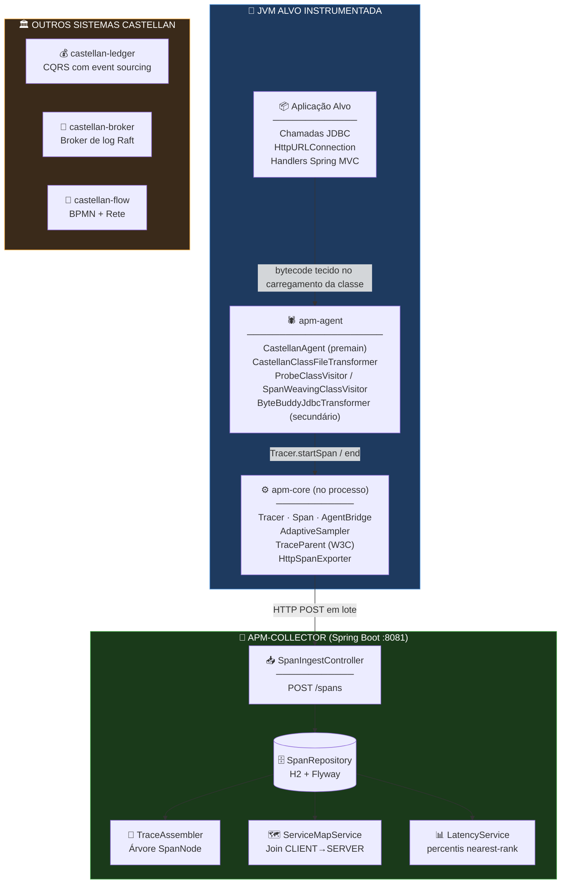
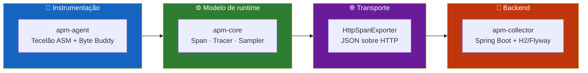
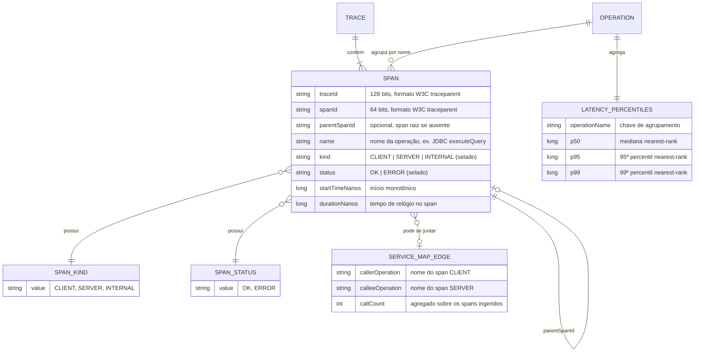
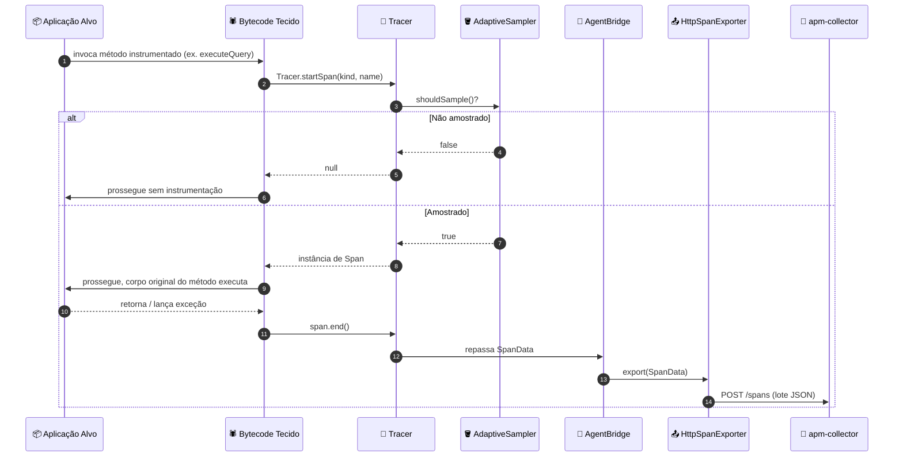
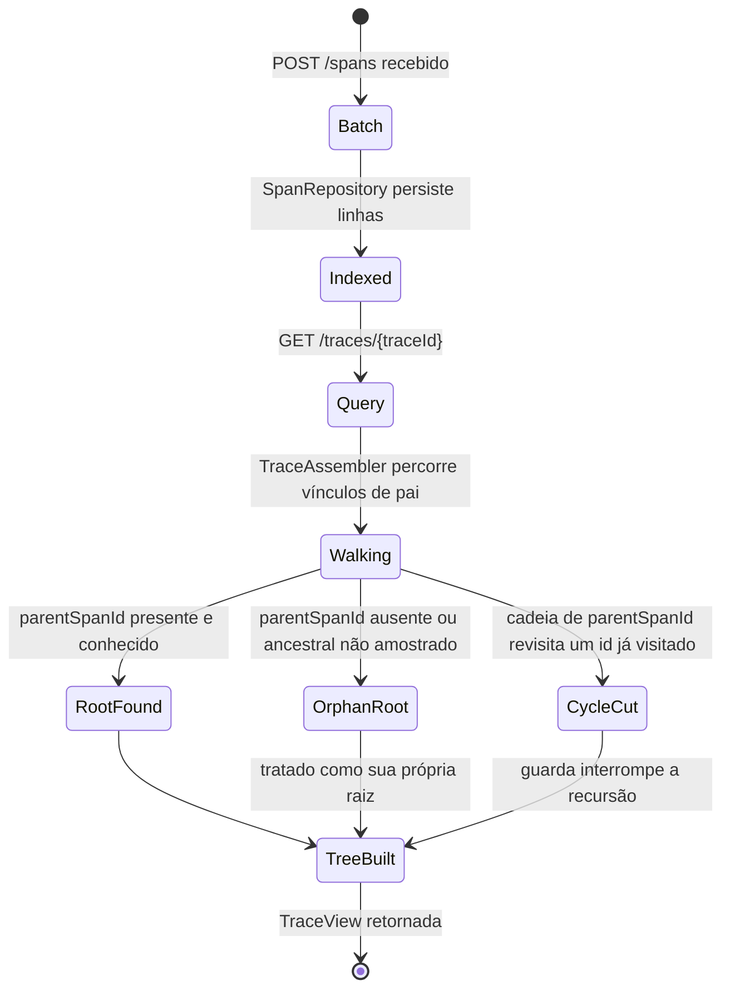
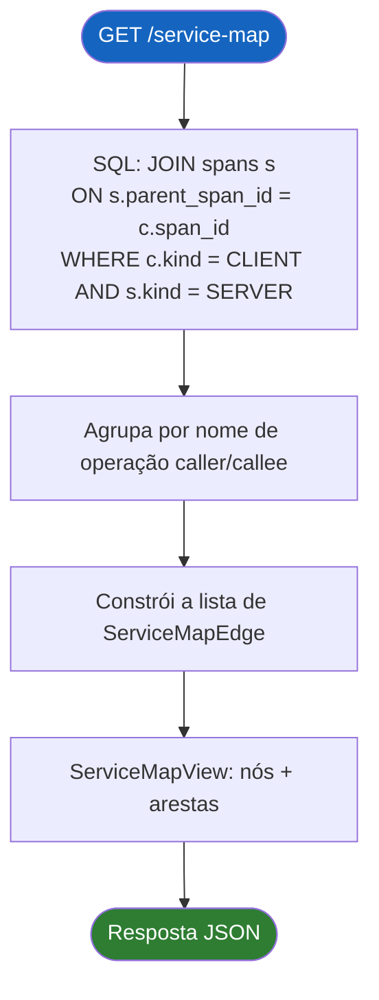
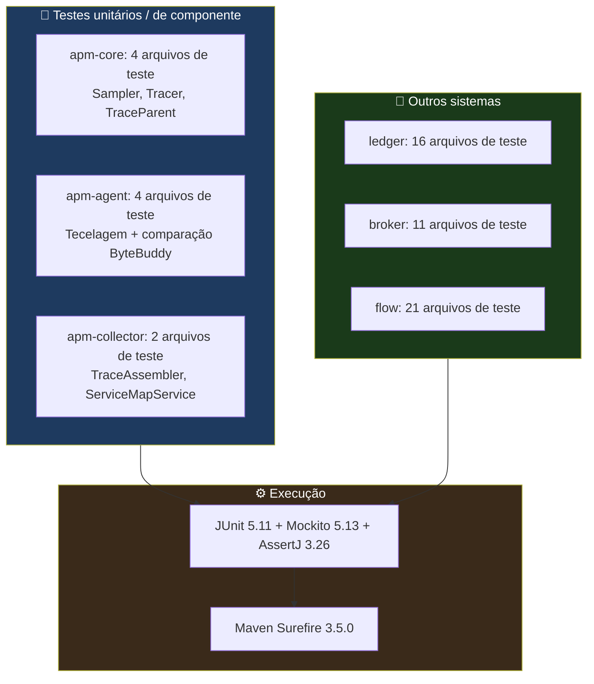

<div align="center">

**🌐 Choose Language / Selecione o Idioma / Elija el Idioma**

[](README.md)&nbsp;&nbsp;&nbsp;[](README_PT.md)&nbsp;&nbsp;&nbsp;[](README_ES.md)

</div>

---

<div align="center">

```
 ██████╗ █████╗ ███████╗████████╗███████╗██╗     ██╗      █████╗ ███╗   ██╗
██╔════╝██╔══██╗██╔════╝╚══██╔══╝██╔════╝██║     ██║     ██╔══██╗████╗  ██║
██║     ███████║███████╗   ██║   █████╗  ██║     ██║     ███████║██╔██╗ ██║
██║     ██╔══██║╚════██║   ██║   ██╔══╝  ██║     ██║     ██╔══██║██║╚██╗██║
╚██████╗██║  ██║███████║   ██║   ███████╗███████╗███████╗██║  ██║██║ ╚████║
 ╚═════╝╚═╝  ╚═╝╚══════╝   ╚═╝   ╚══════╝╚══════╝╚══════╝╚═╝  ╚═╝╚═╝  ╚═══╝
        Quatro sistemas Java construídos à mão: ledger, broker, agente APM, motor de workflow
```

---

[](https://openjdk.org/)
[](https://maven.apache.org/)
[](https://spring.io/projects/spring-boot)
[](https://asm.ow2.io/)
[](https://junit.org/junit5/)
[](https://www.h2database.com/)

<br/>

> **Quatro sistemas Java independentes, cada um construído do zero sem que nenhum framework faça o trabalho estrutural pesado.**
> Um ledger com event sourcing, um broker de log baseado em Raft, um agente de APM que tece bytecode, e um motor de workflow BPMN/Rete.

<br/>


</div>

---

## 📑 Índice

<details>
<summary>▶️ <strong>Clique para expandir / recolher esta seção</strong></summary>

<table>
<tr>
<td valign="top" width="50%">

**🏗️ Sistema**
- [Visão Geral](#-visão-geral)
- [Arquitetura do Sistema](#-arquitetura-do-sistema)
- [Stack Tecnológica](#-stack-tecnológica)
- [Padrões de Projeto Aplicados](#-padrões-de-projeto-aplicados)
- [Estrutura do Projeto](#-estrutura-do-projeto)

**📦 Módulos**
- [castellan-ledger](#-castellan-ledger--ledger-bancário-com-event-sourcing)
- [castellan-broker](#-castellan-broker--broker-de-log-distribuído)
- [castellan-apm (apm-agent)](#-apm-agent--instrumentação-por-tecelagem-de-bytecode)
- [castellan-apm (apm-collector)](#-apm-collector--ingestão-e-consulta-de-traces)
- [castellan-flow](#-castellan-flow--motor-de-workflow-bpmn--rete)

</td>
<td valign="top" width="50%">

**💼 Negócio**
- [Regras de Negócio](#-regras-de-negócio)
- [Requisitos Funcionais](#-requisitos-funcionais)
- [Requisitos Não Funcionais](#-requisitos-não-funcionais)

**📐 Design**
- [Modelo de Dados](#-modelo-de-dados)
- [Fluxos do Sistema](#-fluxos-do-sistema)

**🔐 Segurança & Operações**
- [Segurança](#-segurança)
- [Instalação & Execução](#-instalação--execução)
- [Testes Automatizados](#-testes-automatizados)
- [Métricas & Monitoramento](#-métricas--monitoramento)
- [Limitações Conhecidas](#-limitações-conhecidas)

</td>
</tr>
</table>

---

</details>

## 🌟 Visão Geral

<details>
<summary>▶️ <strong>Clique para expandir / recolher esta seção</strong></summary>

**Castellan** é um único reator Maven contendo quatro sistemas Java independentes, cada um dos quais
enfrenta o tipo de problema de infraestrutura que a maioria das aplicações terceiriza para um framework ou
um serviço gerenciado, construindo a parte estrutural pesada do zero: `castellan-ledger` é um
ledger bancário de dupla entrada com event sourcing, usando CQRS e orquestração de sagas; `castellan-broker`
é um broker de log distribuído (um pequeno Kafka) com uma implementação de consenso Raft escrita à mão, não um
wrapper em torno de uma biblioteca Raft; `castellan-apm` é um agente de Application Performance Monitoring em Java
que instrumenta uma JVM em execução via `java.lang.instrument` e tecelagem de bytecode ASM escrita à mão; e
`castellan-flow` é um motor de processos BPMN 2.0 apoiado por um motor de regras Rete construído desde sua rede
alpha/beta para cima.

Os quatro sistemas não compartilham runtime nem banco de dados. O que compartilham é uma disciplina de camadas: todo
módulo folha tem um núcleo Java puro sem nenhuma dependência de framework na base (`ledger-domain`,
`broker-raft`, `apm-core`, `flow-rules`), uma camada de aplicação/orquestração acima dele e — apenas
onde o sistema realmente precisa — um módulo Spring Boot no topo conectando adaptadores JDBC reais e
controladores REST às camadas abaixo. Cada módulo documenta seus próprios cortes de escopo diretamente no
javadoc em nível de classe; esse javadoc, não nenhum README, é o registro de design autoritativo do projeto.

Este documento foca no `castellan-apm` (o par agente + coletor) como assunto principal, já que é
o componente estilo APM da plataforma, ao mesmo tempo descrevendo os outros três sistemas com precisão
suficiente para entender como o reator inteiro se encaixa e por que as escolhas de design do agente APM (sem
`service.name`, ASM como tecelão primário, Byte Buddy como caminho de comparação) foram feitas do jeito que foram.

### 🎯 Objetivos do Sistema

| Objetivo | Descrição |
|-----------|-------------|
| 🧵 **Propagação de trace** | `apm-agent` tece criação de spans e propagação do W3C `traceparent` em pontos de chamada JDBC, `HttpURLConnection` e Spring MVC sem mudanças de código-fonte na aplicação alvo |
| 🎯 **Amostragem adaptativa** | `AdaptiveSampler` em `apm-core` usa um algoritmo de token bucket para limitar a taxa de spans amostrados em vez de amostrar uma porcentagem fixa |
| 📡 **Ingestão de traces** | `apm-collector` expõe um endpoint HTTP de ingestão (`SpanIngestController`) para o qual o `HttpSpanExporter` do `apm-core` posta lotes de spans exportados |
| 🧩 **Reconstrução de traces** | `TraceAssembler` reconstrói uma árvore de spans pai/filho a partir de um lote plano com ordem arbitrária, tratando de forma defensiva pais ausentes e cíclicos |
| 🗺️ **Derivação do mapa de serviços** | `ServiceMapService` deriva arestas caller/callee puramente a partir de vínculos de pai `CLIENT`→`SERVER`, já que o modelo não carrega identidade de serviço |
| 📊 **Percentis de latência** | `LatencyService` calcula percentis pelo método nearest-rank por nome de operação sobre as N durações mais recentes |
| 💰 **Ledger com event sourcing** | `castellan-ledger` posta transações de dupla entrada como eventos de domínio imutáveis, nunca altera um saldo armazenado |
| 🌳 **Consenso a partir do artigo** | o `broker-raft` do `castellan-broker` implementa a Figura 2 do artigo do Raft como uma máquina de estados pura, sem I/O |
| 🧠 **Motor de regras do zero** | o `flow-rules` do `castellan-flow` é uma rede Rete genuína (nós alpha, nós de join, uma agenda), não uma tabela de decisão |

---

</details>

## 🏗️ Arquitetura do Sistema

<details>
<summary>▶️ <strong>Clique para expandir / recolher esta seção</strong></summary>

### Diagrama de Módulos



### Camadas da Arquitetura



---

</details>

## 🛠️ Stack Tecnológica

<details>
<summary>▶️ <strong>Clique para expandir / recolher esta seção</strong></summary>

<table>
<thead>
<tr>
<th>Camada</th>
<th>Tecnologia</th>
<th>Versão</th>
<th>Propósito</th>
</tr>
</thead>
<tbody>
<tr>
<td rowspan="2"><strong>🧠 Linguagem / Build</strong></td>
<td>Java</td>
<td>21 (<code>maven.compiler.release</code>)</td>
<td>Linguagem-fonte para os 20 módulos, records + interfaces seladas usadas por todo lado</td>
</tr>
<tr>
<td>Maven</td>
<td>reator, <code>packaging=pom</code></td>
<td><code>pom.xml</code> raiz agrega 4 POMs agregadores, 20 módulos folha</td>
</tr>
<tr>
<td rowspan="3"><strong>🕷️ Tecelagem de bytecode (apm-agent)</strong></td>
<td>ASM</td>
<td>9.7 (<code>asm</code>, <code>asm-commons</code>, <code>asm-util</code>)</td>
<td>Tecelão primário: <code>ProbeClassVisitor</code>, <code>SpanWeavingClassVisitor</code>/<code>MethodVisitor</code></td>
</tr>
<tr>
<td>Byte Buddy</td>
<td>1.15.1 (<code>byte-buddy</code>, <code>byte-buddy-agent</code>)</td>
<td>Transformador secundário, apenas para JDBC, usado como comparação (<code>ByteBuddyJdbcTransformer</code>)</td>
</tr>
<tr>
<td><code>java.lang.instrument</code></td>
<td>Nativo do JDK 21</td>
<td>Ponto de entrada premain do <code>CastellanAgent</code>, retransformação de classes</td>
</tr>
<tr>
<td rowspan="4"><strong>📡 apm-collector (Spring Boot)</strong></td>
<td>Spring Boot</td>
<td>3.3.4</td>
<td><code>spring-boot-starter-web</code>, <code>spring-boot-starter-jdbc</code> — conexão REST + JDBC</td>
</tr>
<tr>
<td>H2 Database</td>
<td>2.3.232</td>
<td>Armazenamento relacional embutido para spans, arestas do mapa de serviços, histórico de latência</td>
</tr>
<tr>
<td>Flyway</td>
<td>10.17.3</td>
<td>Migrações de schema versionadas para o schema H2 do coletor</td>
</tr>
<tr>
<td>Jackson</td>
<td>2.17.2 (<code>jackson-databind</code>)</td>
<td>Serialização JSON de spans compartilhada entre o exportador do <code>apm-core</code> e a ingestão do coletor</td>
</tr>
<tr>
<td rowspan="2"><strong>📦 Compartilhado / outros sistemas</strong></td>
<td>SLF4J</td>
<td>2.0.16</td>
<td>Fachada de logging usada em todos os módulos</td>
</tr>
<tr>
<td>Picocli</td>
<td>4.7.6</td>
<td>Parsing de CLI para o processo standalone de nó do <code>broker-server</code></td>
</tr>
<tr>
<td rowspan="3"><strong>🧪 Testes</strong></td>
<td>JUnit</td>
<td>5.11.0 (BOM)</td>
<td>As 58 classes de teste em todo o reator</td>
</tr>
<tr>
<td>Mockito</td>
<td>5.13.0</td>
<td><code>apm-agent</code> o usa para mocking de retransformação/servlet</td>
</tr>
<tr>
<td>AssertJ</td>
<td>3.26.3</td>
<td>Asserções fluentes, dependência de nível raiz para todo módulo</td>
</tr>
<tr>
<td><strong>📦 Empacotamento</strong></td>
<td>Maven Shade Plugin</td>
<td>3.6.0</td>
<td>Constrói o jar do agente do <code>apm-agent</code>, sombreado e autocontido, com entradas de manifesto <code>Premain-Class</code></td>
</tr>
</tbody>
</table>

---

</details>

## 🎨 Padrões de Projeto Aplicados

<details>
<summary>▶️ <strong>Clique para expandir / recolher esta seção</strong></summary>

| Padrão | Onde | Justificativa |
|---------|-------|-----------|
| 🧵 **Visitor** | `ProbeClassVisitor`, `SpanWeavingClassVisitor`, `SpanWeavingMethodVisitor` | A própria cadeia de visitors do ASM é usada para percorrer e reescrever bytecode de classe/método sem uma árvore de parse completa |
| 🧭 **Strategy** | `CastellanAgent` selecionando tecelagem ASM vs. `ByteBuddyJdbcTransformer` via o argumento de agente `transformer=bytebuddy` | Duas estratégias de instrumentação independentes para o mesmo ponto de instrumentação JDBC, mantidas para comparação |
| 🚪 **SPI / Port** | interface `SpanExporter`, implementada por `HttpSpanExporter` e `LoggingSpanExporter` | `apm-core` nunca depende de como os spans saem do processo |
| 🪣 **Token Bucket** | `AdaptiveSampler` | Limita a vazão de spans amostrados sob picos de carga em vez de uma taxa de amostragem percentual fixa |
| 🧱 **Builder / Objeto de plano** | `MethodWeavingPlan`, `MethodProbe` | Regras de instrumentação produzem um objeto de plano intermediário consumido de forma uniforme pelo visitor de tecelagem |
| 🧩 **Transformação em duas fases** | `CastellanClassFileTransformer` delegando para `ClassContext` + `MethodInstrumentationRule`s por alvo (`JdbcInstrumentationRule`, `HttpUrlConnectionInstrumentationRule`, `SpringMvcInstrumentationRule`) | Cada alvo de instrumentação é um objeto de regra autocontido em vez de um único transformador `if/else` grande |
| 🧾 **Hierarquia selada / switch exaustivo** | `SpanKind`, `SpanStatus`, os 11 eventos de domínio do ledger, as 4 formas de RPC do Raft | Conjuntos de variantes fechados são modelados como interfaces seladas do Java 21, nunca um enum aberto com um branch default |
| 🌳 **Reconstrução de árvore com guarda de ciclo** | `TraceAssembler` | Um conjunto de ids visitados previne recursão infinita em uma cadeia de `parentSpanId` malformada/duplicada |
| 🗺️ **Projeção de modelo de leitura** | `AccountBalanceProjection` (ledger), `ServiceMapService` (apm-collector) | Ambos derivam uma view consultável a partir de um log de eventos/spans em vez de mantê-la como estado mutável de agregado |
| ⚙️ **Shell imperativo / núcleo funcional** | `RaftNode` (puro) impulsionado por `RaftEventLoop` (I/O) | Espelha o padrão `raft.Ready()` do etcd para que a lógica de consenso seja testável sem rede nem relógio |

---

</details>

## 📁 Estrutura do Projeto

<details>
<summary>▶️ <strong>Clique para expandir / recolher esta seção</strong></summary>

```
castellan/
│
├── 📄 pom.xml                             # Reator raiz: Java 21, dependencyManagement compartilhado (Spring Boot BOM, JUnit, ASM, Byte Buddy, H2, Flyway, Jackson)
├── 📄 README.md                           # 🇺🇸 English (principal, este arquivo)
├── 📄 README_PT.md                        # 🇧🇷 Português
├── 📄 README_ES.md                        # 🇪🇸 Español
│
├── 📂 castellan-apm/                      # ★ Plataforma de agente + coletor estilo APM (foco deste README)
│   ├── 📄 pom.xml                         # Agregador: apm-core, apm-agent, apm-collector
│   ├── 📂 apm-core/
│   │   └── 📂 src/main/java/io/castellan/apm/core/
│   │       ├── 📄 Tracer.java             # API de contexto de span em ThreadLocal, inicia/encerra spans
│   │       ├── 📄 Span.java / SpanData.java   # Span mutável + forma imutável exportada para a rede
│   │       ├── 📄 SpanKind.java / SpanStatus.java  # Enums selados: CLIENT/SERVER/INTERNAL, OK/ERROR
│   │       ├── 📄 TraceParent.java        # Parse/formatação do header W3C traceparent
│   │       ├── 📄 AgentBridge.java        # A única superfície de chamada que o bytecode tecido do apm-agent invoca
│   │       ├── 📄 IdGenerator.java        # Geração de ids de trace/span
│   │       ├── 📂 sampling/AdaptiveSampler.java  # Amostrador de token bucket
│   │       └── 📂 export/                 # SPI SpanExporter, HttpSpanExporter, LoggingSpanExporter
│   │
│   ├── 📂 apm-agent/
│   │   └── 📂 src/main/java/io/castellan/apm/agent/
│   │       ├── 📄 CastellanAgent.java     # Ponto de entrada premain, parsing de argumentos
│   │       ├── 📄 AgentConfig.java        # Opções collectorUrl / sampleRate / transformer
│   │       ├── 📂 weave/                  # Caminho primário ASM: ClassFileTransformer, visitors, plano de tecelagem
│   │       │   ├── 📄 CastellanClassFileTransformer.java
│   │       │   ├── 📄 ProbeClassVisitor.java / SpanWeavingClassVisitor.java / SpanWeavingMethodVisitor.java
│   │       │   ├── 📄 MethodInstrumentationRule.java / MethodProbe.java / MethodWeavingPlan.java
│   │       │   ├── 📂 jdbc/JdbcInstrumentationRule.java
│   │       │   ├── 📂 http/HttpUrlConnectionInstrumentationRule.java
│   │       │   └── 📂 mvc/SpringMvcInstrumentationRule.java
│   │       └── 📂 bytebuddy/ByteBuddyJdbcTransformer.java   # Transformador JDBC secundário, apenas para comparação
│   │
│   └── 📂 apm-collector/
│       └── 📂 src/main/java/io/castellan/apm/collector/
│           ├── 📄 CollectorApplication.java   # Classe principal do Spring Boot
│           ├── 📂 ingest/SpanIngestController.java / SpanRepository.java   # POST /spans, persistência H2
│           ├── 📂 trace/TraceAssembler.java / TraceController.java / SpanNode.java / TraceView.java  # GET /traces/{id}
│           ├── 📂 servicemap/ServiceMapService.java / ServiceMapController.java  # GET /service-map
│           └── 📂 latency/LatencyService.java / LatencyController.java   # GET /operations/{name}/latency
│
├── 📂 castellan-ledger/                   # Ledger bancário de dupla entrada com event sourcing (4 módulos)
│   ├── 📂 ledger-domain/                  # Money, Account, DoubleEntryTransaction, eventos de domínio, port EventStore
│   ├── 📂 ledger-application/             # Handlers de comando, TransferSagaOrchestrator, FraudRuleEngine
│   ├── 📂 ledger-infrastructure/          # EventStore JDBC, OutboxRelay, projeções de modelo de leitura
│   └── 📂 ledger-api/                     # API REST Spring Boot, TenantResolvingFilter
│
├── 📂 castellan-broker/                   # Broker de log distribuído com Raft escrito à mão (5 módulos)
│   ├── 📂 broker-raft/                    # RaftNode: máquina de estados da Figura 2, sem I/O, sem threads
│   ├── 📂 broker-storage/                 # PartitionLog, FileRaftLog/FilePersistentState
│   ├── 📂 broker-protocol/                # Framing binário de fio + codecs
│   ├── 📂 broker-server/                  # RaftEventLoop, listeners de rede, GroupCoordinator
│   └── 📂 broker-client/                  # Producer, Consumer, LeaderRouter
│
├── 📂 castellan-flow/                     # Motor de processos BPMN + motor de regras Rete (4 módulos)
│   ├── 📂 flow-rules/                     # Rede Rete: AlphaNode, JoinNode, Agenda
│   ├── 📂 flow-bpmn/                      # Parser BPMN 2.0 StAX + ProcessInterpreter
│   ├── 📂 flow-engine/                    # Repositórios duráveis, TimerScheduler, ponte BPMN<->Rete
│   └── 📂 flow-api/                       # API REST Spring Boot
│
└── 📂 docs/
    ├── 📄 ARCHITECTURE.md                 # O mapa de design cross-system autoritativo
    ├── 📄 ROADMAP.md                      # Lista completa e atual de cortes de escopo conhecidos
    └── 📂 adr/                            # 5 Architecture Decision Records (0001-0005)
```

---

</details>

## 📦 Módulos do Sistema

<details>
<summary>▶️ <strong>Clique para expandir / recolher esta seção</strong></summary>

### 🕷️ apm-agent — Instrumentação por tecelagem de bytecode

O ponto de entrada de `java.lang.instrument`. `CastellanAgent.premain` analisa os argumentos do agente
(`collectorUrl`, `sampleRate`, `transformer`) via `AgentConfig`, e então registra
`CastellanClassFileTransformer` junto à instância de `Instrumentation`, de modo que toda classe carregada a partir
daí é oferecida para instrumentação. `ProbeClassVisitor` primeiro decide *se* uma classe corresponde a alguma
`MethodInstrumentationRule`, e apenas as classes que correspondem são entregues ao `SpanWeavingClassVisitor` para
a reescrita de bytecode ASM efetiva, o que mantém o caso comum (uma classe que ninguém quer instrumentar)
barato.

| Responsabilidade | Classe | Superfície de API |
|-----------------|-------|--------------|
| Inicialização do agente | `CastellanAgent` | `premain(String, Instrumentation)` |
| Parsing de argumentos | `AgentConfig` | `collectorUrl=…`, `sampleRate=…`, `transformer=asm\|bytebuddy` |
| Decisão de correspondência e tecelagem | `CastellanClassFileTransformer` | `transform(...)` por carregamento de classe na JVM |
| Detecção de correspondência | `ProbeClassVisitor` | Visita uma classe, produz um `MethodWeavingPlan` |
| Reescrita de bytecode | `SpanWeavingClassVisitor` / `SpanWeavingMethodVisitor` | Envolve métodos correspondentes com chamadas `Tracer.startSpan`/`end` |
| Alvos de instrumentação | `JdbcInstrumentationRule`, `HttpUrlConnectionInstrumentationRule`, `SpringMvcInstrumentationRule` | Cada uma implementa `MethodInstrumentationRule` para uma família de pontos de chamada |
| Caminho de comparação | `ByteBuddyJdbcTransformer` | Apenas JDBC, ativado com `-javaagent:...=transformer=bytebuddy` |

---

### ⚙️ apm-core — Modelo de runtime de tracing

Independente de framework: `Span`/`SpanData`, um `Tracer` que gerencia o span atual via `ThreadLocal`,
`TraceParent` para parsing/formatação do header W3C, `AdaptiveSampler`, e a SPI `SpanExporter`. Nenhuma
manipulação de bytecode vive aqui; `AgentBridge` é a única superfície de chamada estreita que o bytecode tecido
pelo agente de fato invoca em tempo de execução, mantendo as chamadas geradas pelo tecelão em uma API mínima e
estável.

| Responsabilidade | Classe | Notas |
|-----------------|-------|-------|
| Ciclo de vida do span | `Tracer` | `startSpan(kind, name)` retorna `null` para um span não amostrado — nunca enviado adiante |
| Representação de fio | `SpanData` | Forma imutável, serializável via Jackson, postada ao coletor |
| Propagação de trace | `TraceParent` | Formato do header W3C `traceparent` |
| Amostragem | `AdaptiveSampler` | Token bucket; limita a taxa sob carga em vez de uma porcentagem fixa |
| Exportação | `SpanExporter` (SPI), `HttpSpanExporter`, `LoggingSpanExporter` | A exportação HTTP posta lotes para o `/spans` do `apm-collector` |

---

### 📡 apm-collector — Ingestão e consulta de traces

Uma aplicação Spring Boot (`CollectorApplication`, porta `8081` por convenção) que recebe lotes de spans
exportados, persiste-os em H2 via schema migrado por Flyway, e expõe três superfícies de consulta.

| Família de endpoint | Controller | Lógica de apoio |
|-------------------|------------|----------------|
| `POST /spans` | `SpanIngestController` | `SpanRepository` persiste o lote |
| `GET /traces/{traceId}` | `TraceController` | `TraceAssembler` reconstrói a árvore pai/filho `SpanNode` |
| `GET /service-map` | `ServiceMapController` | `ServiceMapService` junta spans `CLIENT`→`SERVER` por `parent_span_id` |
| `GET /operations/{name}/latency` | `LatencyController` | `LatencyService` calcula percentis nearest-rank |

`TraceAssembler` tem duas propriedades defensivas: um span cujo pai nunca foi ele mesmo exportado (um
ancestral não amostrado) se torna sua própria raiz em vez de desaparecer, e uma cadeia cíclica de `parentSpanId`
é interrompida por uma guarda de ids visitados em vez de recursar para sempre.

---

### 💰 castellan-ledger — Ledger bancário com event sourcing

`ledger-domain` modela `Money`, `Account`, `DoubleEntryTransaction` (seu invariante de soma zero é
imposto no construtor) e os eventos de domínio, por trás de um port `EventStore`. `ledger-application`
mantém `PostTransactionHandler` (idempotente via um id de transação determinístico derivado da
chave de idempotência do cliente), `TransferSagaOrchestrator` (uma máquina de estados de saga real e reiniciável), e
`FraudRuleEngine`. `ledger-infrastructure` fornece o `EventStore` JDBC, `OutboxRelay`, e
projeções de modelo de leitura incluindo `AccountBalanceProjection` — o saldo da conta nunca é estado de
agregado, sempre apenas uma projeção calculada a partir de eventos. `ledger-api` é a camada REST Spring Boot com
`TenantResolvingFilter` impondo um `X-Tenant-Id` válido antes que qualquer requisição chegue a um controller.

| Módulo | Classe-chave | Papel |
|--------|-----------|------|
| `ledger-domain` | `DoubleEntryTransaction` | Estruturalmente impossível construir uma transação desbalanceada |
| `ledger-application` | `TransferSagaOrchestrator` | reservar → capturar-ou-falhar → compensar, apoiado por seu próprio stream de eventos |
| `ledger-infrastructure` | `OutboxRelay` | Padrão outbox padrão: escrita na mesma transação, relay retentável de forma independente |
| `ledger-api` | `TenantResolvingFilter` | Rejeita qualquer requisição sem um UUID `X-Tenant-Id` válido |

---

### 🌳 castellan-broker — Broker de log distribuído

O `RaftNode` de `broker-raft` é uma implementação pura, sem I/O, da Figura 2 do artigo do Raft: todo
método público recebe o evento atual e retorna um `HandleResult` (envelopes de saída + resets de
timer), espelhando o padrão `raft.Ready()` do etcd. `broker-storage` fornece `PartitionLog` (segmentado,
estilo Kafka, com recuperação de falha verificada por CRC32C) e o `FileRaftLog`/`FilePersistentState`
fsync'd separadamente. `broker-protocol` define um formato de frame binário customizado. `broker-server` executa
`RaftEventLoop` (o shell imperativo single-thread ao redor de `RaftNode`) e `GroupCoordinator`
(associação de grupo de consumidores, deliberadamente não replicada via Raft). `broker-client` expõe `Producer`,
`Consumer`, e `LeaderRouter`.

| Módulo | Classe-chave | Papel |
|--------|-----------|------|
| `broker-raft` | `RaftNode` | Eleição de líder, replicação de log, segurança — zero threads, zero I/O |
| `broker-storage` | `PartitionLog` | Log append-only segmentado com retenção e compactação |
| `broker-protocol` | `Frame` | Framing binário `[comprimento 4 bytes][tipo 1 byte][payload]` |
| `broker-server` | `RaftEventLoop` | Serializa RPCs, timers e escritas de cliente em chamadas single-thread ao `RaftNode` |
| `broker-client` | `LeaderRouter` | Descoberta/cache de líder compartilhada por `Producer` e `Consumer` |

---

### 🔀 castellan-flow — Motor de workflow BPMN + Rete

`flow-rules` é uma rede Rete genuína (`AlphaNode`, `JoinNode`, `TerminalNode`, uma `Agenda`) construída
do zero, com retratação e versionamento de conjuntos de regras. `flow-bpmn` analisa XML BPMN 2.0 via StAX e
o interpreta com um `ProcessInterpreter` baseado em tokens, incluindo grupos de corrida para timers de fronteira
interruptivos. `flow-engine` faz a ponte entre a execução BPMN e o motor Rete, mantém repositórios duráveis de
processo/instância/timer, e reanalisa o XML BPMN fixado a cada retomada em vez de o armazenar em cache. `flow-api`
é a camada REST Spring Boot com `GlobalExceptionHandler` mapeando erros de parse para
400 e transições estruturalmente inválidas para 422.

| Módulo | Classe-chave | Papel |
|--------|-----------|------|
| `flow-rules` | `Agenda` | Resolve conflitos de ativação por salience e depois ordem de inserção |
| `flow-bpmn` | `ProcessState` | Estado de execução totalmente externalizável — variáveis, tokens, rastreamento de bifurcação/compensação |
| `flow-engine` | `TimerRepository` / `TimerScheduler` | Varredura de intervalo indexada sobre tokens `WAITING_TIMER`, sondagem em segundo plano |
| `flow-api` | `GlobalExceptionHandler` | `BpmnParseException`→400, `BpmnExecutionException`→422, não-encontrado→404 |

---

</details>

## 💼 Regras de Negócio

<details>
<summary>▶️ <strong>Clique para expandir / recolher esta seção</strong></summary>

### 🕷️ Regras de Tracing & Amostragem

| # | Regra | Aplicação |
|---|------|-------------|
| RN-01 | Um span não amostrado nunca deve ser exportado | `Tracer.startSpan` retorna `null` para um span não amostrado, então os pontos de chamada tecidos simplesmente pulam a chamada de exportação |
| RN-02 | A vazão de spans amostrados é limitada, não uma porcentagem fixa | O token bucket do `AdaptiveSampler` reabastece a uma taxa configurada em vez de amostrar a cada N chamadas |
| RN-03 | A injeção de `traceparent` do `HttpURLConnection` deve acontecer em `connect()` | O único ponto antes que os headers não possam mais ser definidos, conforme `HttpUrlConnectionInstrumentationRule` |
| RN-04 | Um handler Spring MVC só continua um trace de entrada se declarar `HttpServletRequest` explicitamente | Corte de escopo declarado em `SpringMvcInstrumentationRule`; handlers sem esse parâmetro iniciam um trace novo |
| RN-05 | Um ponto de chamada JDBC é instrumentado uma vez, nunca embrulhado duas vezes | `ProbeClassVisitor` corresponde antes de `SpanWeavingClassVisitor` reescrever, por classe por passe de transformador |

### 📡 Regras de Montagem de Trace & Mapa de Serviços

| # | Regra | Aplicação |
|---|------|-------------|
| RN-06 | Um span cujo pai nunca foi exportado se torna sua própria raiz | `TraceAssembler` trata um id de pai ausente como uma nova raiz em vez de descartar o span |
| RN-07 | Uma cadeia cíclica de `parentSpanId` não deve recursar para sempre | Guarda de ids visitados em `TraceAssembler`, comprovada por um teste de id duplicado construído |
| RN-08 | Uma aresta de mapa de serviços requer um span `CLIENT` cujo id seja igual ao `parentSpanId` de um span `SERVER` | Join SQL do `ServiceMapService`, não uma travessia de grafo em memória |
| RN-09 | Percentis de latência usam o método nearest-rank sobre as N durações mais recentes por nome de operação | `LatencyService` |

### 💰 Regras do Ledger (para contexto da plataforma)

| # | Regra | Aplicação |
|---|------|-------------|
| RN-10 | Todo conjunto de lançamentos deve somar zero | Imposto no construtor de `DoubleEntryTransaction` |
| RN-11 | Uma postagem retentada com a mesma chave de idempotência não deve postar em duplicidade | O id de transação determinístico do `PostTransactionHandler` + reverificação contra o event store |
| RN-12 | Toda requisição deve carregar um UUID `X-Tenant-Id` válido | `TenantResolvingFilter` rejeita antes do controller |

---

</details>

## ✅ Requisitos Funcionais

<details>
<summary>▶️ <strong>Clique para expandir / recolher esta seção</strong></summary>

| ID | Requisito | Prioridade | Status |
|----|-------------|----------|--------|
| **RF-01** | O agente deve instrumentar chamadas JDBC `Statement`/`PreparedStatement`/`Connection` | 🔴 Alta | ✅ Implementado |
| **RF-02** | O agente deve instrumentar chamadas de saída `HttpURLConnection` com propagação de `traceparent` | 🔴 Alta | ✅ Implementado |
| **RF-03** | O agente deve instrumentar handlers `@RequestMapping` do Spring MVC | 🟡 Média | ✅ Implementado |
| **RF-04** | O agente deve suportar um tecelão baseado em ASM como estratégia primária de instrumentação | 🔴 Alta | ✅ Implementado |
| **RF-05** | O agente deve suportar um transformador JDBC Byte Buddy como estratégia secundária de comparação | 🟢 Baixa | ✅ Implementado |
| **RF-06** | O agente deve aceitar `collectorUrl`, `sampleRate` e `transformer` como argumentos `-javaagent` | 🔴 Alta | ✅ Implementado |
| **RF-07** | O amostrador deve limitar a vazão de spans amostrados via token bucket | 🟡 Média | ✅ Implementado |
| **RF-08** | Spans exportados devem ser postados como lotes JSON no endpoint `/spans` do coletor | 🔴 Alta | ✅ Implementado |
| **RF-09** | O coletor deve persistir spans ingeridos em um banco H2 embutido | 🔴 Alta | ✅ Implementado |
| **RF-10** | O coletor deve reconstruir uma árvore de trace completa a partir de `GET /traces/{traceId}` | 🔴 Alta | ✅ Implementado |
| **RF-11** | O coletor deve derivar um mapa de serviços a partir de `GET /service-map` | 🟡 Média | ✅ Implementado |
| **RF-12** | O coletor deve calcular percentis de latência a partir de `GET /operations/{name}/latency` | 🟡 Média | ✅ Implementado |
| **RF-13** | O coletor deve aplicar migrações Flyway na inicialização | 🟡 Média | ✅ Implementado |
| **RF-14** | O ledger deve postar transações de dupla entrada como eventos de domínio imutáveis | 🔴 Alta | ✅ Implementado |
| **RF-15** | O ledger deve executar transferências por meio de um orquestrador de saga reiniciável | 🔴 Alta | ✅ Implementado |
| **RF-16** | O broker deve eleger um líder e replicar um log via Raft | 🔴 Alta | ✅ Implementado |
| **RF-17** | O cliente do broker deve suportar um modo de produtor idempotente | 🟡 Média | ✅ Implementado |
| **RF-18** | O motor de fluxo deve analisar e interpretar definições de processo XML BPMN 2.0 | 🔴 Alta | ✅ Implementado |
| **RF-19** | O motor de fluxo deve avaliar conjuntos de regras via uma rede Rete construída do zero | 🟡 Média | ✅ Implementado |
| **RF-20** | O motor de fluxo deve disparar timers de fronteira via um agendador em segundo plano | 🟡 Média | ✅ Implementado |
| **RF-21** | O agente deve ser empacotado (shade) em um único jar autocontido com entradas de manifesto `Premain-Class` | 🔴 Alta | ✅ Implementado |

---

</details>

## ⚡ Requisitos Não Funcionais

<details>
<summary>▶️ <strong>Clique para expandir / recolher esta seção</strong></summary>

| ID | Categoria | Requisito | Meta |
|----|----------|-------------|--------|
| **RNF-01** | ⚡ Performance | A tecelagem ASM deve adicionar overhead negligenciável por carregamento de classe | Tecendo apenas classes correspondidas por `ProbeClassVisitor`, não toda classe carregada |
| **RNF-02** | ⚡ Performance | O amostrador não deve permitir exportação ilimitada de spans sob carga | A taxa de reabastecimento do token bucket é o limite rígido, conforme `AdaptiveSampler` |
| **RNF-03** | 🧵 Concorrência | `RaftNode` deve ser chamável com segurança sem sincronização externa | Garantido pelo executor single-thread do `RaftEventLoop`, não pelo próprio `RaftNode` |
| **RNF-04** | 💾 Durabilidade | Uma entrada de log Raft, uma vez confirmada, deve sobreviver a uma falha | fsync por entrada em `FileRaftLog`/`FilePersistentState` |
| **RNF-05** | 💾 Durabilidade | Uma instância de processo estacionada em um timer deve retomar corretamente a partir do disco | Comprovado pelo `RestartResumptionTest` de `flow-engine` com um grafo de objetos novo |
| **RNF-06** | 🔐 Consistência | O saldo armazenado de uma conta nunca deve divergir de seu stream de eventos | O saldo é uma projeção, nunca estado mutável de agregado |
| **RNF-07** | 🔐 Consistência | Uma escrita concorrente no mesmo stream de eventos não deve silenciosamente perder uma atualização | `ConcurrencyConflictException` em caso de divergência de `expectedVersion` |
| **RNF-08** | 🧩 Portabilidade | `apm-core` deve ter zero dependência de manipulação de bytecode | `apm-agent` depende de `apm-core`, nunca o contrário |
| **RNF-09** | 🧱 Modularidade | O núcleo Java puro de todo módulo folha deve ter zero dependência de Spring | `ledger-domain`, `broker-raft`, `apm-core`, `flow-rules` |
| **RNF-10** | 🧪 Testabilidade | `RaftNode` deve ser testável sem rede, relógio ou thread | `RaftClusterSimulationTest` conduz 3 nós puramente via feedback de `HandleResult` |
| **RNF-11** | 🌍 Compatibilidade | Todos os módulos devem ter como alvo o Java 21 | `maven.compiler.release=21` na raiz do reator |
| **RNF-12** | 📦 Empacotamento | `apm-agent` deve produzir um único jar implantável | Maven Shade Plugin, `shadedClassifierName=agent` |
| **RNF-13** | 🔧 Manutenibilidade | Todo conjunto de variantes fechado deve usar uma interface selada, nunca um enum aberto com default | `SpanKind`, `SpanStatus`, os eventos de domínio do ledger, as formas de RPC do Raft |
| **RNF-14** | 🗄️ Recuperabilidade | Uma escrita final incompleta em um segmento de log de partição não deve corromper o log | `Segment.openOrCreate` revalida o CRC32C e trunca até o último limite conhecido como bom |

---

</details>

## 🗄️ Modelo de Dados

<details>
<summary>▶️ <strong>Clique para expandir / recolher esta seção</strong></summary>

### Diagrama Entidade-Relacionamento



### Schema H2 do `apm-collector` (gerenciado por Flyway)

| Grupo de colunas | Tabela | Notas |
|---------------|-------|-------|
| Identidade do span | `spans` | `trace_id`, `span_id`, `parent_span_id` (opcional) — alvo primário de ingestão do `SpanIngestController` |
| Atributos do span | `spans` | `name`, `kind`, `status`, `start_time_nanos`, `duration_nanos` |
| Views derivadas | em memória, não tabelas | `TraceAssembler`, `ServiceMapService`, `LatencyService` calculam suas views a partir de `spans` no momento da consulta, sem tabela materializada separada |

### Chaves de Configuração do Agente (em memória, não persistidas)

| Chave | Analisada por | Padrão | Significado |
|-----|-----------|---------|---------|
| `collectorUrl` | `AgentConfig` | nenhum, obrigatório para exportação HTTP | Destino para `HttpSpanExporter` |
| `sampleRate` | `AgentConfig` | padrão de implementação | Parâmetro de reabastecimento do token bucket para `AdaptiveSampler` |
| `transformer` | `AgentConfig` | `asm` | `asm` (padrão, cobertura total) ou `bytebuddy` (apenas JDBC, comparação) |

---

</details>

## 🔄 Fluxos do Sistema

<details>
<summary>▶️ <strong>Clique para expandir / recolher esta seção</strong></summary>

### Fluxo de Criação e Exportação de Span



### Tratamento de Estados na Reconstrução de Trace



### Fluxo de Derivação do Mapa de Serviços



---

</details>

## 🔐 Segurança

<details>
<summary>▶️ <strong>Clique para expandir / recolher esta seção</strong></summary>

### Controles Implementados

| Controle | Implementação | Efeito |
|---------|---------------|--------|
| 🎯 **Instrumentação com escopo definido** | Implementações de `MethodInstrumentationRule` só correspondem a pontos de chamada JDBC, `HttpURLConnection` e `@RequestMapping` | O agente nunca reescreve lógica de aplicação arbitrária fora de seus alvos declarados |
| 🧵 **`traceparent` no ponto juridicamente correto** | `HttpUrlConnectionInstrumentationRule` injeta o header em `connect()` | Evita a `IllegalStateException` ao definir headers depois da conexão |
| 🚦 **Caminho seguro para falhas não amostradas** | `Tracer.startSpan` retorna `null` para spans não amostrados | Nenhum span parcial ou malformado é jamais construído para trabalho que nunca seria exportado |
| 🔒 **Isolamento multi-tenant (ledger)** | `TenantResolvingFilter` rejeita qualquer requisição sem um UUID `X-Tenant-Id` válido | Toda consulta de repositório subsequente é escopada por tenant na camada SQL |
| 🌳 **Segurança de consenso** | `RaftNode.advanceCommitIndexIfPossible` só confirma com base em uma maioria do termo atual | Previne o bug clássico do Raft de confirmar silenciosamente uma entrada obsoleta de um termo anterior |
| 🧾 **Concorrência otimista (ledger)** | Verificação de `expectedVersion` em toda anexação de evento | Um escritor concorrente recebe `ConcurrencyConflictException`, nunca uma atualização perdida silenciosamente |
| 🗄️ **Recuperação de log verificada por CRC** | `Segment.openOrCreate` revalida CRC32C ao abrir | Uma escrita final incompleta é truncada, não confiada silenciosamente |

### Limitações de Segurança Conhecidas

> [!WARNING]
> Estas são inerentes ao design atual e declaradas no próprio javadoc dos módulos; devem ser
> compreendidas antes de qualquer componente aqui ser reutilizado fora de um contexto de aprendizado/demo.

| Limitação | Risco | Caminho de mitigação |
|------------|------|-----------------|
| 🌐 **Sem autenticação na ingestão do coletor** | `POST /spans` aceita qualquer chamador | Adicionar uma verificação de chave de API ou mTLS na frente do `SpanIngestController` |
| 🌐 **Sem autenticação no protocolo de cliente do broker** | Qualquer cliente TCP que fale o framing pode produzir/consumir | Adicionar handshake estilo SASL ao `broker-protocol` |
| 🔓 **Payloads de span trafegam sem criptografia por padrão** | `HttpSpanExporter` usa HTTP puro a menos que a própria `collectorUrl` seja `https://` | Implantar atrás de terminação TLS ou configurar uma URL de coletor `https://` |
| 🧬 **Sem `service.name` no modelo de tracing** | Um lote de spans malicioso pode alegar pertencer a qualquer nome de operação | Não é uma lacuna de controle de segurança por omissão, mas um corte de escopo de modelagem declarado em `SpanKind`/`ServiceMapService` |
| 🕳️ **`X-Tenant-Id` é um header bruto fornecido pelo cliente** | Um chamador ainda poderia forjar o UUID de outro tenant na ausência de uma camada de autenticação | Adicionar autenticação real (ex. OAuth2/JWT) na frente do `TenantResolvingFilter`, que só valida formato e presença |
| 📛 **A associação do `GroupCoordinator` não é replicada via Raft** | Um split-brain durante um failover de coordinator poderia brevemente atribuir a mesma partição duas vezes | Tradeoff documentado e deliberado — os membros simplesmente rejoin no novo líder |

---

</details>

## 🚀 Instalação & Execução

<details>
<summary>▶️ <strong>Clique para expandir / recolher esta seção</strong></summary>

### Pré-requisitos

```bash
# JDK Java 21
java -version         # espera 21+

# Maven 3.9+
mvn -version

# Nenhum serviço externo necessário — H2 é embutido, nós Raft são processos JVM simples
```

### Build

```bash
# A partir da raiz do repositório -- constrói e testa todo módulo do reator (336 testes)
mvn clean test

# Constrói apenas os sistemas APM e sua dependência (apm-core)
mvn -pl castellan-apm/apm-core,castellan-apm/apm-agent,castellan-apm/apm-collector -am test

# Empacota o jar do agente sombreado e autocontido
mvn -pl castellan-apm/apm-agent -am package
# Saída: castellan-apm/apm-agent/target/apm-agent-0.1.0-agent.jar
```

### Execução

```bash
# 1. Inicia o coletor (Spring Boot, :8081)
mvn -pl castellan-apm/apm-collector -am spring-boot:run

# 2. Anexa o agente a qualquer aplicação JVM alvo
java -javaagent:castellan-apm/apm-agent/target/apm-agent-0.1.0-agent.jar=collectorUrl=http://localhost:8081/spans,sampleRate=1000 \
  -jar your-application.jar

# 3. Consulta o coletor
curl localhost:8081/traces/<traceId>
curl localhost:8081/service-map
curl localhost:8081/operations/JDBC%20executeQuery/latency

# Opcional: executa com o transformador JDBC Byte Buddy secundário em vez de ASM
java -javaagent:apm-agent-0.1.0-agent.jar=collectorUrl=http://localhost:8081/spans,transformer=bytebuddy \
  -jar your-application.jar
```

Os outros três sistemas se constroem e executam da mesma forma a partir da raiz do repositório:

```bash
mvn -pl castellan-ledger/ledger-api -am spring-boot:run    # :8080
mvn -pl castellan-flow/flow-api -am spring-boot:run        # :8082
mvn -pl castellan-broker/broker-server -am package
java -jar castellan-broker/broker-server/target/broker-server-*.jar \
  --node-id n0 --data-dir /tmp/n0 \
  --cluster n0@127.0.0.1:9100:9101,n1@127.0.0.1:9200:9201,n2@127.0.0.1:9300:9301
```

### Alvos Maven

| Alvo | Propósito |
|--------|---------|
| `mvn clean test` | Constrói e testa todo módulo do reator |
| `mvn -pl <module> -am test` | Constrói e testa um módulo mais suas dependências |
| `mvn -pl <module> -am package` | Empacota um módulo (produz jars, incluindo o jar sombreado do agente) |
| `mvn -pl <spring-boot-module> -am spring-boot:run` | Executa `ledger-api`, `apm-collector` ou `flow-api` |
| `mvn -pl castellan-broker/broker-server -am package && java -jar ...` | Executa um nó standalone do `broker-server` |

### Configuração de Build

| Configuração | Valor | Declarado em |
|---------|-------|-------------|
| `maven.compiler.release` | `21` | `<properties>` do `pom.xml` raiz |
| `groupId` / `artifactId` raiz | `io.castellan` / `castellan` | `pom.xml` raiz |
| Classificador sombreado do `apm-agent` | `agent` | Configuração do shade-plugin em `apm-agent/pom.xml` |
| `Premain-Class` / `Agent-Class` | `io.castellan.apm.agent.CastellanAgent` | Transformador de manifesto em `apm-agent/pom.xml` |
| Classe principal do `apm-collector` | `io.castellan.apm.collector.CollectorApplication` | Configuração do spring-boot-maven-plugin em `apm-collector/pom.xml` |
| `argLine` do Surefire | `-Xshare:off` | `pluginManagement` do `pom.xml` raiz |

---

</details>

## 🧪 Testes Automatizados

<details>
<summary>▶️ <strong>Clique para expandir / recolher esta seção</strong></summary>

### Arquitetura de Testes



| Módulo | Arquivos de teste | Suíte notável |
|--------|-----------|-----------------|
| `apm-core` | 4 | `AdaptiveSamplerTest` — taxa em regime permanente medida apenas após drenar o burst inicial de tokens |
| `apm-agent` | 4 | Testes de correção de tecelagem + testes de retransformação do `ByteBuddyJdbcTransformer` |
| `apm-collector` | 2 | `TraceAssemblerTest` — teste de ciclo com `spanId` duplicado construído |
| `castellan-ledger` (4 módulos) | 16 | Compensação de saga, postagem idempotente, consistência de projeção |
| `castellan-broker` (5 módulos) | 11 | `RaftClusterSimulationTest` — cluster de 3 nós conduzido puramente via feedback de `HandleResult` |
| `castellan-flow` (4 módulos) | 21 | `RestartResumptionTest`, `BoundaryTimerInterpretationTest`, `FlowApiIntegrationTest` |
| **Total** | **58 arquivos de teste / 336 testes** | 0 falhas, 0 erros em todo o reator |

### Executando os Testes

```bash
# Todo módulo do reator
mvn clean test

# Apenas os sistemas APM
mvn -pl castellan-apm/apm-core,castellan-apm/apm-agent,castellan-apm/apm-collector -am test

# Um único módulo
mvn -pl castellan-broker/broker-raft -am test

# Relatórios HTML/XML do Surefire ficam em target/surefire-reports de cada módulo
```

### Checklist Manual de Aceitação

| # | Cenário | Resultado esperado |
|---|----------|-----------------|
| 1 | Inicia o `apm-collector`, anexa o agente a uma aplicação que usa JDBC | `POST /spans` recebe lotes, `GET /traces/{id}` retorna uma árvore populada |
| 2 | Chama uma requisição de saída `HttpURLConnection` instrumentada | A requisição de saída carrega um header `traceparent` injetado em `connect()` |
| 3 | Define `sampleRate` bem baixo | Menos spans são exportados, mas o comportamento da própria aplicação não é afetado |
| 4 | Anexa com `transformer=bytebuddy` | Apenas chamadas JDBC são instrumentadas, Spring MVC e HTTP não |
| 5 | Consulta `GET /service-map` após tráfego misto CLIENT/SERVER | As arestas refletem apenas spans com um vínculo real de pai `CLIENT`→`SERVER` |
| 6 | Posta um lote de spans com um `parentSpanId` autorreferencial | `GET /traces/{id}` ainda retorna sem travar ou dar erro |
| 7 | Consulta `GET /operations/{name}/latency` | p50/p95/p99 refletem o método nearest-rank sobre as amostras mais recentes |

---

</details>

## 📊 Métricas & Monitoramento

<details>
<summary>▶️ <strong>Clique para expandir / recolher esta seção</strong></summary>

### Métricas do Código

| Métrica | Valor |
|--------|-------|
| Módulos Maven | 20 módulos folha sob 4 agregadores + reator raiz |
| Arquivos Java fonte principais | 295 |
| Arquivos de teste | 58 (336 testes, 0 falhas, 0 erros) |
| Classes principais do `apm-agent` | 14 (visitors de tecelagem, regras, config, caminho de comparação ByteBuddy) |
| Classes principais do `apm-core` | 12 (Span/Tracer/Sampler/SPI de export) |
| Classes principais do `apm-collector` | 13 (ingest, trace, service-map, latency) |
| Architecture Decision Records | 5, em `docs/adr/` |
| Nível de linguagem Java | 21 (`maven.compiler.release`) |

### Sinais de Runtime

| Sinal | Origem | Onde observar |
|--------|--------|------------------|
| Sucesso/falha de exportação de span | `HttpSpanExporter` | Logs da aplicação (SLF4J), log de acesso do coletor |
| Contagem de spans ingeridos | `SpanIngestController` → `SpanRepository` | Contagem de linhas da tabela H2 `spans` |
| Taxa de decisão do amostrador | `AdaptiveSampler` | Compara spans emitidos pela aplicação vs. spans recebidos pelo coletor |
| Mudanças de líder/termo do Raft | `RaftEventLoop` | Logs de processo do `broker-server` |
| Anomalias de reconstrução de trace | `TraceAssembler` | Contagens de raiz órfã ou corte de ciclo, se registradas pelo chamador |

### Comandos de Diagnóstico Úteis

```bash
# Confirma que o agente foi anexado e que o premain executou
java -javaagent:apm-agent-0.1.0-agent.jar=collectorUrl=http://localhost:8081/spans -jar app.jar 2>&1 | grep -i castellan

# Observa os logs do Spring Boot do coletor
mvn -pl castellan-apm/apm-collector -am spring-boot:run

# Confirma que um trace foi montado corretamente / que o mapa de serviços reflete as arestas esperadas
curl -s localhost:8081/traces/<traceId> | jq .
curl -s localhost:8081/service-map | jq .
```

### Códigos de Retorno / Status Padronizados

| Código | Onde | Significado |
|------|-------|---------|
| `200` | Endpoints REST do `apm-collector` | Ingestão ou consulta bem-sucedida |
| `400` | `GlobalExceptionHandler` do `flow-api` | `BpmnParseException` — XML submetido malformado |
| `404` | `GlobalExceptionHandler` do `flow-api` | `NoSuchProcessInstanceException` |
| `422` | `GlobalExceptionHandler` do `flow-api` | `BpmnExecutionException` — transição estruturalmente inválida |
| `null` (Span) | `Tracer.startSpan` | Sentinela para "não amostrado", não um erro |
| `ConcurrencyConflictException` | `ledger-infrastructure` | Violação de concorrência otimista na anexação de evento |

---

</details>

## ⚠️ Limitações Conhecidas

<details>
<summary>▶️ <strong>Clique para expandir / recolher esta seção</strong></summary>

> [!IMPORTANT]
> Cada módulo declara seus próprios tradeoffs de design e cortes de escopo diretamente no javadoc em
> nível de classe — essa é a fonte autoritativa, não este README. `docs/ROADMAP.md` contém a lista
> completa e atual.

| Categoria | Problema | Status |
|----------|-------|--------|
| 🌐 **Sem `service.name`** | O modelo de dados de tracing não carrega identidade de serviço por processo; o mapa de serviços é derivado puramente de vínculos de pai de spans `CLIENT`/`SERVER` | ➕ Intencional, documentado em `SpanKind` e `ServiceMapService` |
| 🧭 **Continuação de trace de entrada no Spring MVC** | Apenas handlers com um parâmetro `HttpServletRequest` explícito continuam um trace de entrada | ➕ Intencional, documentado em `SpringMvcInstrumentationRule` |
| 🔀 **Handshake de grupo de consumidores colapsado** | O protocolo de `broker-server` funde o `JoinGroup`+`SyncGroup` de duas fases do Kafka em uma única ida e volta | ➕ Intencional, documentado em `GroupCoordinator` |
| 🧾 **Janela de dedup do produtor idempotente é 1** | Apenas o mais recente `(producerId, sequence)` por partição é lembrado, não uma janela como a de cinco do Kafka | ➕ Intencional, documentado em `CommandApplier` |
| 🧩 **Conjuntos de regras JSON suportam apenas um padrão** | Um predicado de join não tem forma textual; conjuntos de regras com join devem usar o builder tipado do `flow-rules` diretamente | ➕ Intencional, documentado em `JsonRuleDefinition`, ver ADR 0005 |
| 🗳️ **Sem mudanças de associação de cluster Raft** | Nenhum consenso conjunto (§6); a associação do cluster é estática durante seu tempo de vida | ➕ Intencional, documentado em `broker-raft`, ver ADR 0002 |
| 🧊 **Sem snapshotting de log Raft** | O log de consenso é retido por completo, não compactado via snapshot (§7) | ➕ Intencional, distinto da compactação separada do log de dados do `broker-storage` |
| 🔐 **Sem autenticação na ingestão do coletor ou no protocolo do broker** | Qualquer chamador que alcance a porta pode postar spans ou produzir/consumir | ⚠️ Aberto |
| 🧬 **Empacotamento de release do `apm-agent` não é minificado/ofuscado** | O jar sombreado contém bytecode legível | ➕ Intencional para uma ferramenta de diagnóstico |
| 📐 **`flow-engine` reanalisa o XML BPMN a cada retomada** | Nenhum grafo analisado em cache, escolha deliberada de simplicidade sobre a complexidade de invalidação de cache | ➕ Intencional, documentado em `ProcessEngine` |
| 🧵 **Conjunto fixo de alvos de instrumentação** | Apenas JDBC, `HttpURLConnection` e Spring MVC são tecidos | ⚠️ Aberto |

> [!TIP]
> O próximo passo de maior valor para o `castellan-apm` é adicionar um `service.name` (ou identidade
> equivalente por processo) ao modelo de span, já que essa é a única lacuna que mais limita a utilidade
> do mapa de serviços além de uma demo de processo único, conforme a nota de design em `ServiceMapService`.

</details>

---

<div align="center">

---

### 🏰 Castellan

*Quatro sistemas, sem atalhos, sem framework fazendo o trabalho estrutural pesado*

[](https://openjdk.org/)
[](https://asm.ow2.io/)
[](https://spring.io/projects/spring-boot)
[]()

<br/>

```
"Um trace só é tão confiável quanto o tecelão que o escreveu,
 e um sistema só é tão honesto quanto o javadoc que admite o que ele deixou de fazer."
```

</div>
